# WorkSpace Security Analyst & Network Monitoring — Operating Workflows v1

## Status

Design-only operational specification. It converts the architecture into implementation-ready workflow contracts without granting any runtime authority.

This document answers four questions for every workflow:

1. **Who** performs each stage?
2. **What input/output** crosses the stage boundary?
3. **What deterministic gate** must pass?
4. **What happens on failure/restart/retry?**

---

# 1. Actors

```text
Scheduler
  time-based trigger only; no device authority

Monitoring Policy Engine
  resolves approved assets, collector profiles, limits and data classes

Collector Broker
  grants only predeclared read-only collector actions to known targets

Collectors
  ICMP/TCP, SNMPv3, local-state and fixed read-only adapters

Normalizer
  converts source-specific records into canonical observation/event schemas

Detection Engine
  exact rules, thresholds, baselines, robust statistics and template checks

Correlation Engine
  groups related findings/evidence using deterministic keys/windows

Evidence Store
  SQLite metadata + bounded compressed evidence partitions

Local AI Analyst
  optional compact analysis only; no collection/remediation authority

Report Builder
  deterministic skeleton, evidence validation and artifact generation

NAS Archive Writer
  writes only validated report bundles to a pre-mounted approved path

Security Analyst / Admin
  reviews findings and authorizes exceptional actions such as packet capture

Specialized UI
  read/inspect/report/control surface; opening it grants no collector authority
```

---

# 2. Hourly workflow — swimlane

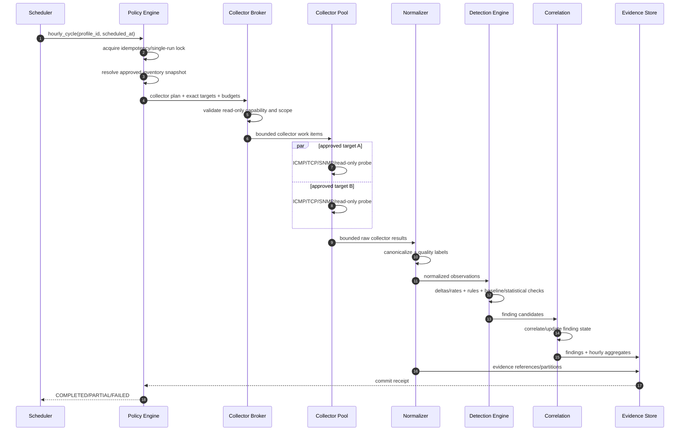

## 2.1 Inputs

```text
monitoring_profile_id
scheduled_at
policy_version
approved_inventory_version/hash
collector_registry_version
previous validated hourly sample refs
```

## 2.2 Outputs

```text
hourly_run_id
run status
coverage percentage
asset observations
interface aggregates
network-health aggregates
finding updates
data-gap updates
source freshness
collector error summary
evidence partition refs
hourly receipt SHA/hash metadata
```

## 2.3 Idempotency key

Recommended:

```text
hourly:<profile_id>:<YYYY-MM-DDTHH Asia/Tokyo>
```

Only one terminal receipt may own the canonical hourly slot. A restart/catch-up creates a new attempt under the same slot key and explicit attempt number; it must not manufacture a historical sample timestamp.

## 2.4 Hard gates

Before collector execution:

```text
feature enabled
profile valid
single-run lock acquired
asset exists in approved inventory
collector action is allowlisted
collector is read-only
exact management target allowed
credential handle reference valid if required
resource budget available
```

After collection:

```text
schema valid
source attribution valid
counter discontinuity classified
observation timestamp in accepted window
raw/evidence size within bound
```

Before completion:

```text
metadata transaction committed
coverage calculated
all failures classified
hourly receipt durable
```

---

# 3. Passive log/event intake — swimlane

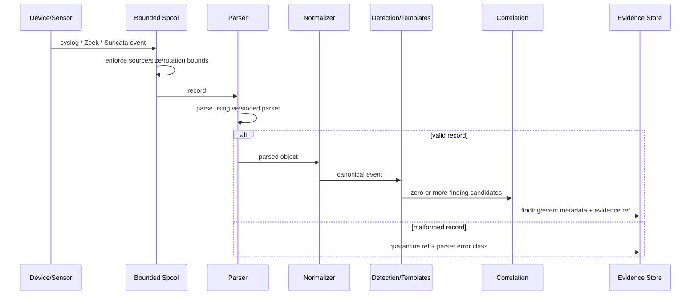

## Invariants

- parser errors are observable;
- source identity comes from trusted listener/source mapping;
- raw web/file/log instructions remain data, not authority;
- no passive event can grant a tool capability;
- continuous ingestion has bounded spool/rotation/backpressure behavior.

---

# 4. High/Critical finding — immediate path

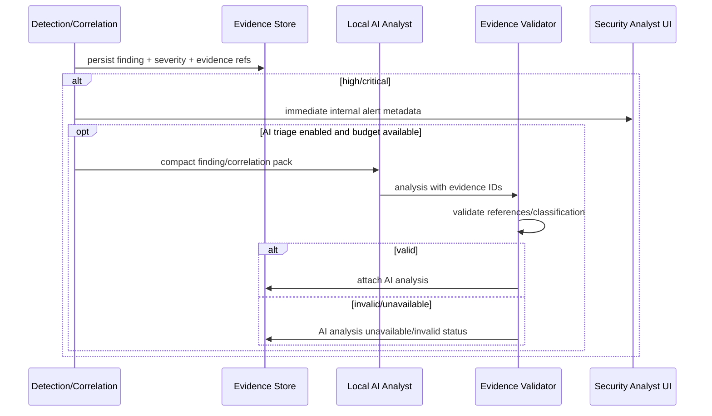

The immediate alert must not depend on AI availability.

---

# 5. 17:30 daily report — swimlane

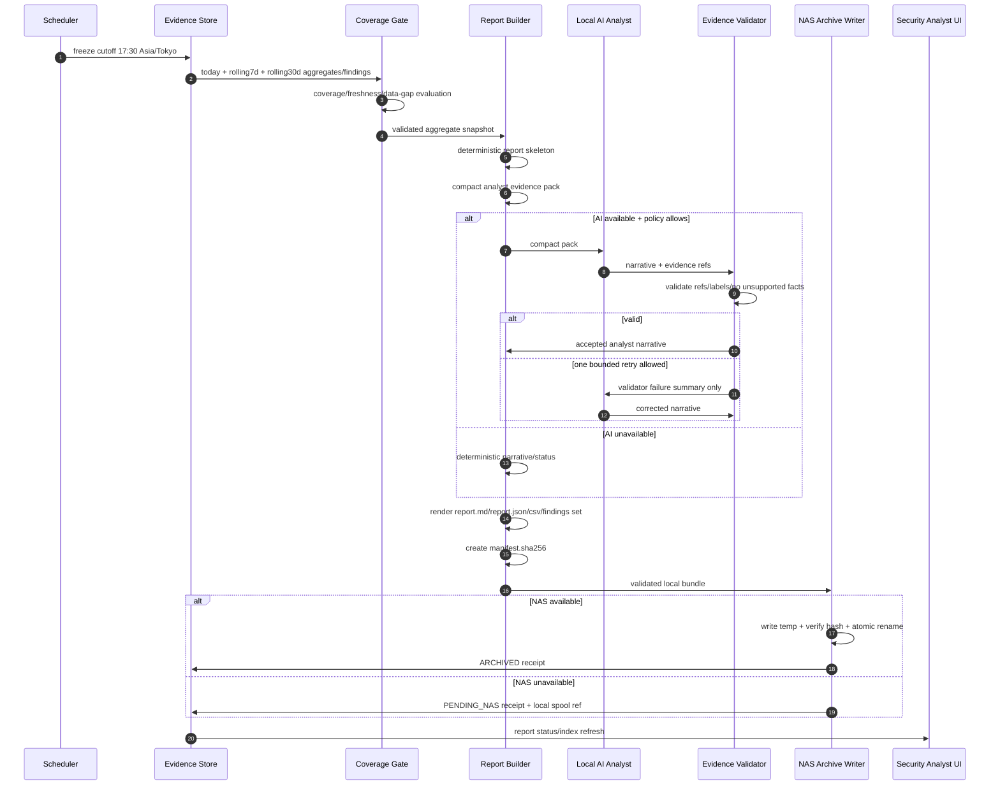

## Daily report input contract

```text
cutoff timestamp
inventory snapshot/version
monitoring policy version
parser/rule versions
coverage summary
hourly aggregate refs
finding refs/open/closed deltas
trend aggregates
sensor health/data gaps
NAS health
```

No unbounded raw log corpus enters the normal daily LLM context.

## Daily report completion gate

A daily report is `COMPLETED` only when:

```text
report cutoff frozen
coverage/data gaps explicitly calculated
deterministic skeleton rendered
all narrative evidence references validated
artifact hashes generated
local report bundle durable
archive state explicitly ARCHIVED or PENDING_NAS
```

`PENDING_NAS` is a valid report generation state but not an archived state.

---

# 6. Weekly canonical archive workflow

Trigger: Sunday 17:30 Asia/Tokyo.

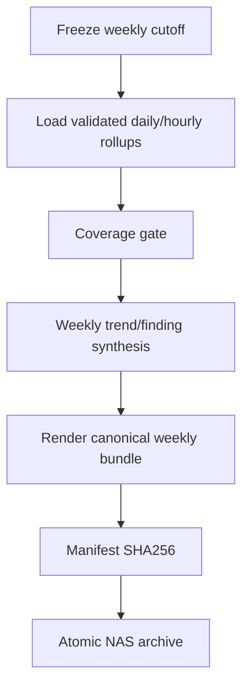

Idempotency key:

```text
weekly:<profile_id>:<ISO-year>-W<week>
```

Do not re-read all raw logs when validated aggregates/findings suffice.

---

# 7. Monthly canonical archive workflow

Trigger: last local calendar day at 17:30.

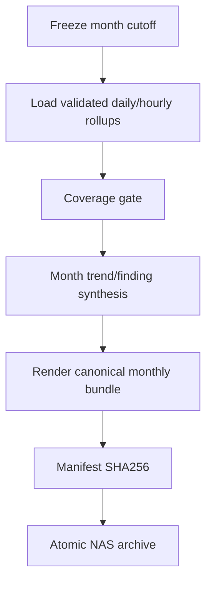

Idempotency key:

```text
monthly:<profile_id>:<YYYY-MM>
```

---

# 8. Pending NAS retry workflow

Hourly monitoring may retry validated bundles in `PENDING_NAS` state.

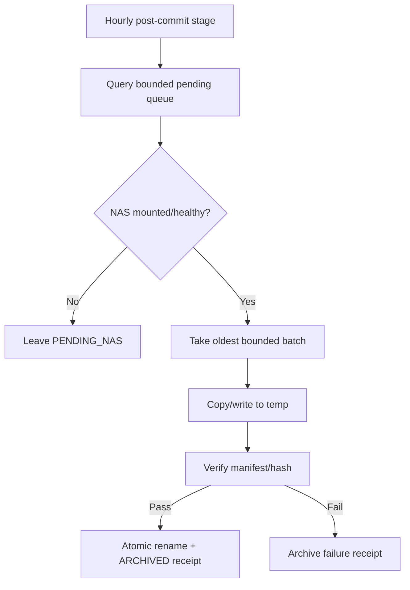

Rules:

- bounded number/bytes per hourly retry;
- no report regeneration during archive retry;
- no overwrite of different final hash;
- archived report is immutable.

---

# 9. Unknown-device workflow

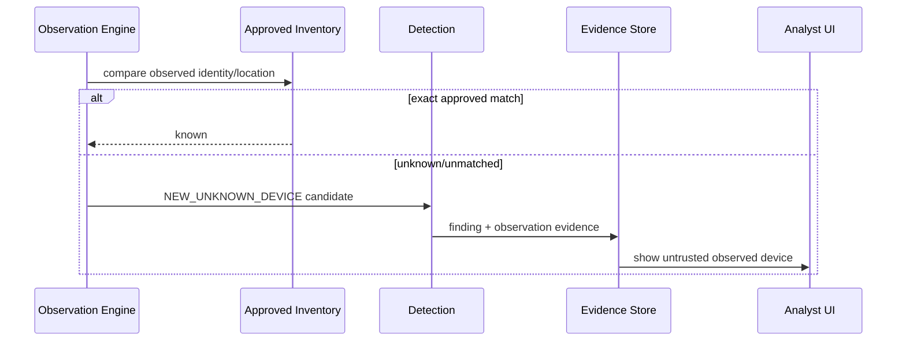

No automatic inventory enrollment exists in this workflow.

---

# 10. Manual investigation workflow

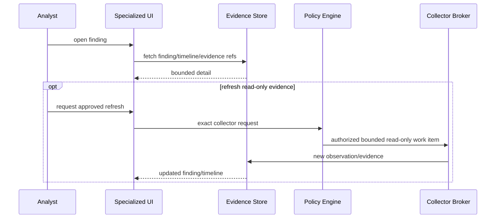

There is no free-form command box in the analyst view.

---

# 11. Incident PCAP workflow — exceptional authority

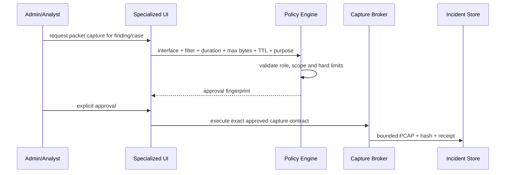

Capture authority is not part of normal hourly monitoring.

---

# 12. UI refresh workflow

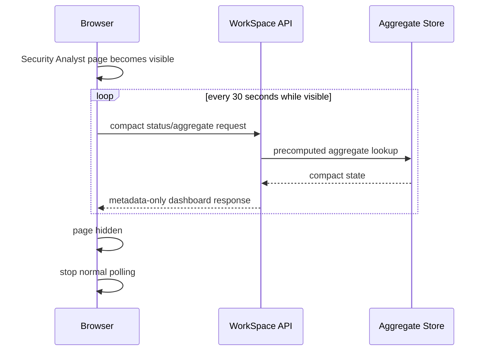

The browser never triggers the hourly collector merely by opening/refreshing the page.

---

# 13. Scheduler ownership and catch-up policy

V1 should use operating-system timers rather than add a scheduler framework/service.

Logical timers:

```text
workspace-network-hourly.timer
workspace-network-report-daily.timer
```

Weekly/monthly canonical generation may be evaluated from the 17:30 daily report runner after the cutoff calendar condition, avoiding two additional long-lived services.

Timer responsibilities are limited to invoking deterministic CLI/entrypoints. They do not contain credentials or network commands.

Catch-up rules:

```text
hourly missed cycles -> max one catch-up sample after startup
17:30 report missed  -> one catch-up using original intended cutoff when evidence permits, otherwise explicit delayed-report cutoff/status
weekly/monthly       -> derive from validated period state with idempotency key
```

---

# 14. Concurrency contract

Concurrency is useful only for independent approved targets.

```text
collector workers default: small bounded value (e.g. 4)
per-device concurrent collector actions: 1 by default
per-management-endpoint rate limit: configured
AI calls during normal hourly collection: 0
AI calls in normal daily reporting: 1
```

A later benchmark may change worker count. Higher concurrency is not automatically an optimization.

---

# 15. Workflow observability

Every run exposes compact metadata:

```text
run_id
workflow_type
scheduled_at
started_at
finished_at
status
attempt
policy_version
inventory_hash
asset_count_expected
asset_count_observed
coverage_pct
collector_success_count
collector_failure_count
finding_delta_by_severity
data_gap_count
AI_calls
report_id if applicable
archive_status
failure_classes
```

Do not put raw credentials, raw packet payload, full logs, or full AI prompts into workflow audit metadata.

---

# 16. Implementation mapping

The future implementation should map the above workflows to small components rather than one giant security-agent loop:

```text
network_monitoring/schemas.py
network_monitoring/inventory.py
network_monitoring/policy.py
network_monitoring/collector_broker.py
network_monitoring/collectors/
network_monitoring/normalize.py
network_monitoring/detection.py
network_monitoring/correlation.py
network_monitoring/store.py
network_monitoring/reporting.py
network_monitoring/nas_archive.py
network_monitoring/cli.py
```

AI-specific skills remain procedural modules loaded only for triage/reporting; collectors and authorization remain deterministic runtime code.

---

# 17. Code-start workflow

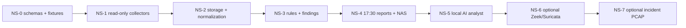

No later phase may be used to justify weakening an earlier security boundary.
