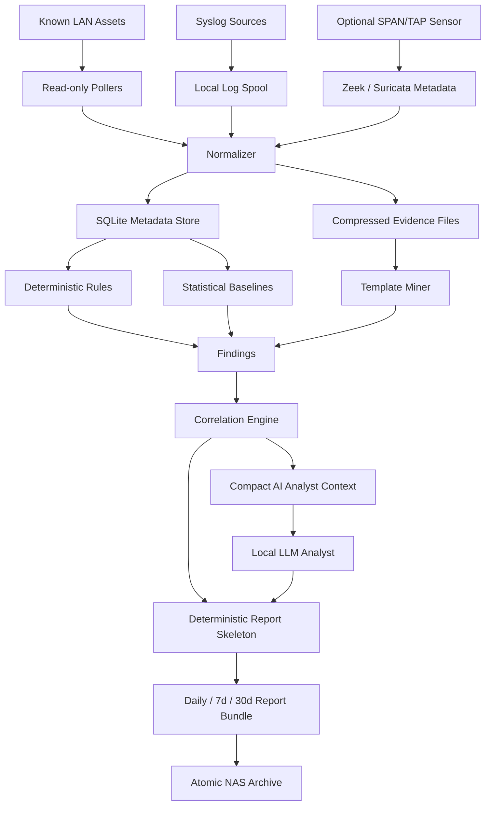
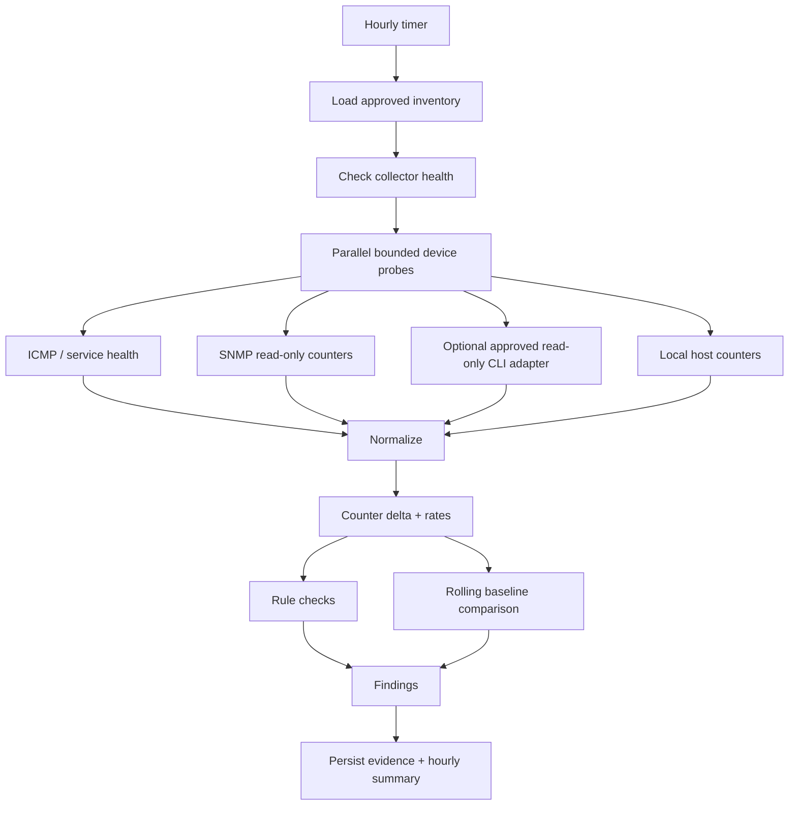

# WorkSpace Security Analyst & Network Monitoring — Research and Design Specification v1

## Status

**Research-first / design-only. No production monitoring code is authorized by this document.**

This document defines the first specialized WorkSpace feature for internal enterprise security operations: continuous log intake, hourly LAN health/state collection, network-security analysis, anomaly correlation, and automated daily/weekly/monthly reporting to a preconfigured NAS path.

The design follows the WorkSpace doctrine:

```text
avoid > reuse > precompute > compact > deterministic code > parallelize > accelerate > scale hardware
```

The goal is not to recreate a full commercial SIEM or SOC stack. The goal is to obtain enough trustworthy evidence for an internal security analyst while using the least infrastructure, RAM, VRAM, storage, network traffic, and operational complexity possible.

---

# 1. Product objective

Create a specialized WorkSpace capability tentatively named:

**WorkSpace Network Sentinel / Security Analyst**

It must:

1. continuously ingest security-relevant logs where passive streaming is available;
2. run a bounded, read-only LAN health/state collection workflow every hour;
3. collect bandwidth/interface counters, device availability, errors, drops, topology changes, new devices, relevant security logs, and optional network-flow metadata;
4. normalize and compress observations before AI analysis;
5. apply deterministic rules and statistical anomaly detection before invoking an LLM;
6. correlate evidence into incidents/findings;
7. generate at 17:30 every day one evidence-backed report containing:
   - the current day;
   - rolling 7-day summary;
   - rolling 30-day summary;
8. create canonical weekly and monthly archive reports at period boundaries;
9. atomically save report bundles to a configured NAS mount;
10. remain local-first, least-privilege, auditable, and safe for confidential business infrastructure.

This feature is **monitoring and analysis**, not autonomous network remediation.

---

# 2. Enterprise control alignment

The implementation should map its controls to:

- ISO/IEC 27001 information-security management principles;
- NIST Cybersecurity Framework 2.0;
- NIST SP 800-92 log-management guidance;
- CIS Controls v8.1, especially:
  - Control 8 — Audit Log Management;
  - Control 12 — Network Infrastructure Management;
  - Control 13 — Network Monitoring and Defense;
  - Safeguard 13.6 — collect network traffic flow logs and/or traffic for review and alerting.

These are engineering reference controls, not certification claims.

---

# 3. Open-source projects studied

The project intentionally extracts engineering principles, not source code or copyrighted skill text.

## 3.1 Wazuh

Sources:

- https://documentation.wazuh.com/current/quickstart.html
- https://github.com/wazuh/wazuh

Useful ideas:

- endpoint and infrastructure log centralization;
- security events normalized before analysis;
- structured JSON is preferable for machine processing;
- rules and detections should sit above raw log ingestion;
- central reporting should preserve source/device lineage.

Decision for WorkSpace:

**Do not embed the complete Wazuh stack in v1.** The server/indexer/dashboard architecture is valuable at scale but unnecessarily heavy for the initial constrained deployment.

Extract the separation:

```text
collector -> normalized event -> detection -> finding -> analyst report
```

---

## 3.2 Security Onion

Sources:

- https://docs.securityonion.net/en/2.4/introduction.html
- https://docs.securityonion.net/en/2.4/network.html

Useful ideas:

Security Onion combines complementary evidence sources instead of expecting one sensor to answer everything:

- Suricata for signature-based IDS;
- Zeek for protocol/session metadata;
- optional full packet capture;
- osquery/endpoint telemetry;
- centralized investigation and case management.

Decision for WorkSpace:

Adopt the **layered telemetry philosophy**, but not the full distribution.

The WorkSpace hierarchy should be:

```text
L0 inventory/state
L1 counters/availability
L2 logs/events
L3 flow/protocol metadata
L4 IDS detections
L5 packet payload/PCAP only for explicitly authorized incidents
```

L5 must be OFF by default.

---

## 3.3 Malcolm

Sources:

- https://github.com/cisagov/Malcolm
- https://github.com/cisagov/Malcolm/blob/main/docs/README.md

Useful ideas:

- Zeek logs, Suricata alerts and PCAP are different evidence types;
- normalize/enrich/correlate network-session data before analyst review;
- enrich events with asset inventory and network-segment context;
- PCAP can remain optional while session metadata provides normal operational visibility;
- smaller environments can still gain value without a large distributed sensor grid.

Decision for WorkSpace:

Adopt:

```text
raw sensor evidence
  -> normalized session/event
  -> asset enrichment
  -> correlation
  -> finding
```

Do not deploy OpenSearch/Arkime as mandatory v1 infrastructure.

---

## 3.4 Zeek

Sources:

- https://github.com/zeek/zeek
- https://docs.zeek.org/en/master/reference/logs/conn.html

Useful ideas:

Zeek treats network traffic as high-level transactions rather than as an endless packet byte stream. `conn.log` and protocol-specific logs provide semantic evidence that is much smaller and more useful for correlation than full PCAP.

Decision for WorkSpace:

**Zeek-style metadata is the preferred deep-visibility input.**

Examples of useful normalized fields:

- timestamp;
- source/destination IP;
- source/destination port;
- transport protocol;
- duration;
- bytes/packets;
- connection state;
- application protocol;
- DNS name/result metadata where available;
- TLS metadata/fingerprint where available.

Do not send complete Zeek log history to the LLM. Aggregate first.

---

## 3.5 Suricata

Sources:

- https://docs.suricata.io/en/latest/output/eve/eve-json-output.html
- https://docs.suricata.io/en/latest/output/eve/eve-json-format.html

Useful ideas:

Suricata EVE JSON exposes a common structured stream containing alerts, anomalies, flows, protocol records and statistics.

Decision for WorkSpace:

When a Suricata sensor exists, ingest only configured EVE event categories needed by policy.

Default recommendation:

- alert: ON;
- anomaly: ON;
- flow: ON if storage allows;
- stats: ON;
- selected DNS/TLS metadata: optional;
- payload dumping: OFF;
- password/application-secret logging: OFF.

A signature match is evidence, not automatic proof of compromise.

---

## 3.6 ntopng

Sources:

- https://www.ntop.org/products/traffic-analysis/ntopng/
- https://github.com/ntop/ntopng

Useful ideas:

- traffic should be understood as conversations/flows and top talkers;
- useful sources include SPAN/TAP, NetFlow/sFlow, SNMP and firewall logs;
- bandwidth visibility can be separated from full packet content.

Decision for WorkSpace:

Implement lightweight equivalents of:

- top source/destination devices;
- bandwidth per uplink/interface;
- protocol/service distribution if flow metadata exists;
- sudden traffic shifts;
- new or unusual east-west conversations.

No dependency on the ntopng server in v1.

---

## 3.7 Prometheus blackbox_exporter, snmp_exporter and node_exporter

Sources:

- https://github.com/prometheus/blackbox_exporter
- https://github.com/prometheus/snmp_exporter
- https://prometheus.io/docs/guides/node-exporter/

Useful ideas:

- black-box probes answer availability/latency questions without agents;
- SNMP is appropriate for network-device counters;
- host metrics should expose counters, not raw operational data;
- collection protocols are distinct from storage/query systems.

Decision for WorkSpace:

Use **read-only SNMP + bounded ICMP/TCP service checks** as the default low-cost LAN collection layer.

Prefer SNMPv3.

SNMPv1/v2c may be supported only as an explicitly configured legacy read-only mode because the community value is transmitted without encryption.

---

## 3.8 LibreNMS

Source:

- https://docs.librenms.org/Support/Features/

Useful ideas:

- auto-discovery;
- ARP/FDB collection;
- VLAN and network-protocol state;
- distributed polling;
- syslog and flow integration;
- device counters form a reliable operational baseline.

Decision for WorkSpace:

Borrow the **network poller model**, but keep discovery separate from hourly monitoring.

Hourly monitoring should poll known inventory. Broad discovery should not scan the complete LAN every hour.

---

## 3.9 osquery

Source:

- https://github.com/osquery/osquery

Useful ideas:

Expose endpoint state as deterministic structured tables: processes, listening connections, hardware, hashes and system configuration.

Decision for WorkSpace:

Endpoint telemetry is an **optional adapter**, not a mandatory v1 dependency.

Where osquery already exists, WorkSpace may ingest approved query results. It should not deploy arbitrary live SQL supplied by an LLM.

---

## 3.10 rsyslog / Fluent Bit / Vector

Sources:

- https://github.com/rsyslog/rsyslog
- https://vector.dev/docs/introduction/
- https://github.com/fluent/fluent-bit-perf

Useful ideas:

- log transport should be lightweight and reliable;
- collection, transformation and routing are separate stages;
- resource consumption of telemetry infrastructure itself must be measured.

Decision for WorkSpace:

Do not build a complex proprietary syslog transport when an existing host daemon can do it safely.

Preferred v1 approach on Linux:

```text
network devices -> rsyslog local spool -> WorkSpace parser
```

If a site already standardizes on Fluent Bit or Vector, add an adapter rather than installing another collector.

---

## 3.11 Grafana Loki

Sources:

- https://github.com/grafana/loki
- https://grafana.com/docs/loki/latest/get-started/labels/

Useful ideas:

Loki reduces cost by indexing a small metadata label set rather than the entire log body. High-cardinality labels such as arbitrary IP values must be handled carefully.

Decision for WorkSpace:

Apply the principle without requiring Loki in v1:

```text
small indexed metadata
+
compressed raw/normalized evidence files
```

Do not create database indexes on every possible log field.

---

## 3.12 VictoriaMetrics

Sources:

- https://github.com/VictoriaMetrics/VictoriaMetrics
- https://docs.victoriametrics.com/victoriametrics/

Useful ideas:

The single-node deployment is intentionally optimized for storage, bandwidth, IOPS, RAM and CPU.

Decision for WorkSpace:

Do not require a time-series server initially. Use SQLite + compact files first.

VictoriaMetrics single-node becomes the preferred scale-out candidate only when benchmark evidence shows SQLite aggregation/query cost is inadequate.

---

## 3.13 Drain3

Source:

- https://github.com/logpai/Drain3

Useful ideas:

Drain3 performs online log-template mining with a bounded-depth parse tree. Repeated raw messages can become one stable template plus changing parameters.

Example principle:

```text
"port Gi1/0/8 changed state to down"
"port Gi1/0/9 changed state to down"

->

"port <*> changed state to down"
count = 2
```

Decision for WorkSpace:

Log-template compression is highly valuable because it reduces storage and LLM context.

Implement a small project-owned template layer first or benchmark Drain3 as an optional dependency. Do not install deep-learning packages merely to parse repeated log text.

---

## 3.14 Salesforce LogAI, LogPAI Loglizer and deep-loglizer

Sources:

- https://github.com/salesforce/logai
- https://github.com/logpai/loglizer
- https://github.com/logpai/deep-loglizer

Useful ideas:

Their common anomaly-analysis pipeline is more important than any one model:

```text
collection
-> parsing
-> sequence/window construction
-> feature extraction
-> anomaly detector
-> evaluation
```

LogAI also demonstrates a unified preprocessing layer and benchmarking of multiple statistical/ML/deep-learning methods.

Decision for WorkSpace:

Do **not** start with deep learning.

V1 order:

1. thresholds/invariants;
2. robust rolling statistics;
3. template-frequency anomalies;
4. optional Isolation Forest or similar only after benchmark;
5. deep model only if simpler techniques fail a measurable requirement.

---

## 3.15 Sigma

Sources:

- https://github.com/SigmaHQ/sigma
- https://github.com/SigmaHQ/sigma-specification

Useful ideas:

Sigma separates:

- rule identity/metadata;
- log source;
- detection pattern;
- false positives;
- severity;
- references/tags.

Decision for WorkSpace:

Create a small project-owned rule schema inspired by portable detection engineering principles.

Do not copy SigmaHQ community rules wholesale. Sigma rules have their own Detection Rule License, and every imported rule must pass provenance/license/security review.

---

## 3.16 NetBox

Sources:

- https://github.com/netbox-community/netbox
- https://github.com/netbox-community/netbox/blob/main/docs/introduction.md

Most important principle:

**desired/source-of-truth state is not the same thing as discovered operational state.**

NetBox intentionally discourages automatically treating live-discovered state as authoritative inventory.

Decision for WorkSpace:

Maintain two objects:

```text
Approved Asset Inventory
        !=
Observed Network State
```

New MAC/IP/device observations become findings until an operator approves them into inventory.

---

## 3.17 Arkime / full packet capture

Source:

- https://github.com/arkime/arkime

Useful idea:

Full packet capture can provide forensic depth.

Decision for WorkSpace:

**Do not enable continuous full PCAP by default.**

Reasons:

- heavy disk and write bandwidth;
- high privacy/confidentiality risk;
- packet payload may contain credentials, files or business data;
- high-speed networks rapidly make storage requirements impractical.

PCAP belongs to an incident-only mode with explicit operator authorization, bounded duration and short retention.

---

## 3.18 OpenSearch Security Analytics

Sources:

- https://docs.opensearch.org/latest/security-analytics/
- https://github.com/opensearch-project/security-analytics

Useful ideas:

- detection rules;
- findings;
- correlation;
- alert lifecycle;
- separation of read versus detector-management permissions.

Decision for WorkSpace:

Adopt the findings/correlation/role-separation concepts. Do not require an OpenSearch cluster for the first version.

---

# 4. Architecture decision

## 4.1 Do not build a mini Security Onion

Rejected initial stack:

```text
Elasticsearch/OpenSearch
+ Kafka
+ Redis
+ Grafana
+ Loki
+ Prometheus
+ Wazuh
+ Zeek
+ Suricata
+ Arkime
+ AI
```

It is powerful but violates WorkSpace's constrained-infrastructure doctrine for a first specialized feature.

## 4.2 Adopt a three-tier architecture



The LLM is downstream of evidence reduction.

---

# 5. Telemetry hierarchy

## Tier 0 — Inventory

Authoritative operator-approved records:

- asset ID;
- hostname/label;
- management IP;
- MAC where applicable;
- asset class;
- site/VLAN/segment;
- device vendor/model;
- criticality;
- approved monitoring protocol;
- maintenance window;
- owner/contact reference.

Inventory changes require explicit operator action.

## Tier 1 — Hourly operational state

Cheap, deterministic polling:

- ICMP availability;
- RTT/packet loss;
- selected TCP service reachability;
- interface operational state;
- interface octet counters;
- error/discard counters;
- device uptime;
- CPU/memory/temperature where exposed safely;
- uplink bandwidth delta;
- ARP/FDB table summary;
- LLDP neighbor summary;
- VLAN/STP summary where needed;
- NAS free capacity;
- monitoring sensor health;
- clock/NTP offset where measurable.

## Tier 2 — Logs

Continuous or batched:

- router/switch/AP syslog;
- server system logs;
- WorkSpace audit/security logs;
- firewall logs if present;
- optional Windows/Linux endpoint security logs.

## Tier 3 — Flow/session metadata

Optional network sensor:

- Zeek connection/session logs;
- NetFlow/sFlow/IPFIX if available;
- Suricata flow metadata.

## Tier 4 — IDS/security detections

- Suricata alerts;
- WorkSpace rules;
- reviewed Sigma-derived rules;
- endpoint security alerts.

## Tier 5 — Payload / PCAP

Default: **DENY**.

Only incident-mode authorization may enable it.

---

# 6. Hourly collection workflow

Every hour, preferably with a per-device jitter so all equipment is not polled simultaneously:



## 6.1 Do not run broad port scans every hour

Hourly monitoring polls **known inventory**.

Discovery is separate because continuous active scanning:

- creates unnecessary traffic;
- increases false positives;
- can trigger security appliances;
- expands authority unnecessarily.

Suggested discovery policy:

- ARP/FDB/LLDP changes: hourly, because obtained from known infrastructure;
- low-rate ICMP discovery of declared subnets: daily or operator-triggered;
- port/service inventory scan: manual or separately approved security-assessment workflow.

---

# 7. Safe command/capability model

The LLM never writes shell commands.

A deterministic adapter chooses from a closed command vocabulary.

Examples of permitted capability classes:

```text
probe.icmp
probe.tcp
snmp.get
snmp.bulk_read
host.net_interface_stats
host.socket_summary
host.neighbor_table
network_device.read_interface_counters
network_device.read_event_log_summary
network_device.read_fdb
network_device.read_lldp
network_device.read_vlan_summary
network_device.read_stp_summary
```

Forbidden by default:

```text
configure terminal
write memory
reload/reboot
firmware update
SNMP SET
arbitrary SSH command
arbitrary shell
arbitrary nmap scan
packet injection
credential dump
full configuration dump
```

Some network-device configuration output may contain SNMP communities, keys or business-sensitive topology. Therefore `show running-config`-style collection is **not** part of default hourly monitoring.

---

# 8. Bandwidth measurement

Do not estimate LAN utilization from packet captures when interface counters are available.

For each monitored interface:

```text
rx_bps = (rx_octets_now - rx_octets_previous) * 8 / elapsed_seconds

tx_bps = (tx_octets_now - tx_octets_previous) * 8 / elapsed_seconds

utilization_pct = max(rx_bps, tx_bps) / interface_speed_bps * 100
```

Counter handling must support wrap/reset detection.

Store:

- raw counter;
- previous counter timestamp;
- calculated rate;
- utilization percentile;
- errors/discards delta.

Useful findings:

- sustained > 80% utilization;
- abrupt increase relative to baseline;
- high drops while utilization is low;
- CRC/error growth;
- asymmetric traffic spike;
- interface flap;
- unexpected new high-volume talker when flow metadata exists.

Thresholds must be configurable and baseline-aware.

---

# 9. Log normalization pipeline

```text
raw line/event
  -> source classifier
  -> timestamp normalization
  -> severity normalization
  -> asset mapping
  -> template extraction
  -> sensitive-field masking
  -> canonical event
  -> rule evaluation
```

Canonical minimum event:

```json
{
  "event_id": "...",
  "observed_at": "...",
  "source_asset_id": "...",
  "source_type": "syslog|suricata|zeek|host|workspace",
  "category": "network|auth|interface|ids|system|policy",
  "severity": "info|low|medium|high|critical",
  "template_id": "...",
  "message_hash": "sha256:...",
  "fields": {},
  "evidence_ref": "..."
}
```

Raw messages are evidence, not prompt text.

---

# 10. Detection hierarchy

Use the cheapest reliable method first.

## D0 — deterministic invariants

Examples:

- known device unreachable;
- interface expected UP becomes DOWN;
- new MAC appears on protected segment;
- duplicate IP/MAC conflict;
- link error/discard growth;
- sensor stopped producing data;
- NAS archival failed;
- system time drift;
- Suricata high-severity signature;
- repeated authentication failures over fixed threshold.

## D1 — rule engine

Project-owned YAML/JSON rules with:

- rule ID;
- source type;
- required fields;
- predicate;
- severity;
- asset-criticality adjustment;
- false-positive notes;
- evidence requirements;
- suppression/cooldown.

## D2 — statistical anomaly

Preferred initial methods:

- median/MAD;
- EWMA;
- rolling percentiles;
- change-point style deltas;
- frequency deviation;
- hour-of-day/day-of-week seasonal baseline after enough data exists.

Do not call every 2-sigma deviation a security incident.

## D3 — template anomaly

Examples:

- new log template;
- rare template frequency spike;
- known error template appearing on a new device class;
- repeated flapping template.

## D4 — optional classical ML

Only after benchmark:

- Isolation Forest;
- PCA/other compact models.

## D5 — local LLM analyst

The LLM receives **findings and compact evidence**, not the full raw dataset.

Tasks:

- explain correlated evidence;
- propose plausible causes;
- group related findings;
- rank investigation priority;
- produce human-readable reports;
- state uncertainty.

It cannot clear a deterministic alert, change a device, widen monitoring scope or authorize capture.

---

# 11. Baseline learning

A new deployment needs a warm-up state.

Recommended initial policy:

```text
Day 0-1    deterministic checks only
Day 2-6    collect statistics, anomaly labels advisory
Day >=7    enable simple rolling baseline anomalies
Day >=30   enable reliable weekly/hour-of-day comparisons
```

Never train "normal" blindly during an active incident.

Maintenance windows and known changes must be tagged so they do not poison the baseline.

---

# 12. Finding model

A finding is not an incident.

Example schema:

```json
{
  "finding_id": "...",
  "first_seen": "...",
  "last_seen": "...",
  "asset_ids": ["..."],
  "category": "availability|performance|security|topology|logging",
  "severity": "low|medium|high|critical",
  "confidence": 0.0,
  "detectors": ["rule:...", "baseline:..."],
  "evidence_refs": ["..."],
  "status": "open|acknowledged|resolved|suppressed",
  "summary": "..."
}
```

Suggested priority function:

```text
priority =
  base_severity
+ asset_criticality
+ persistence
+ anomaly_magnitude
+ corroborating_sources
- known_maintenance
- validated_false_positive_weight
```

Use deterministic scoring. The LLM may explain the score but should not invent it.

---

# 13. Correlation workflow

Correlation keys may include:

- asset ID;
- IP/MAC;
- interface ID;
- VLAN/segment;
- Suricata flow ID;
- time window;
- rule/template family.

Example:

```text
10:05 switch uplink drops increase
10:06 camera VLAN latency increases
10:07 multiple cameras become unreachable
10:07 switch syslog reports link flap

=> one correlated network-path incident candidate
```

The LLM should see this compact timeline rather than thousands of raw lines.

---

# 14. Reporting at 17:30

At **17:30 every day**, create one report bundle containing three windows:

1. **Today** — since previous daily boundary;
2. **Rolling 7 days**;
3. **Rolling 30 days**.

The report must be evidence-driven even if the LLM is unavailable.

## 14.1 Deterministic report sections

- monitored asset count;
- assets unavailable;
- uptime/availability summary;
- packet loss/RTT summary;
- top interface utilization;
- bandwidth peaks;
- errors/discards;
- interface flaps;
- new/changed network neighbors;
- new devices observed;
- log counts by source/severity/template;
- IDS/security detections;
- open findings;
- resolved findings;
- collection failures/data gaps;
- NAS archival state;
- sensor health;
- evidence completeness score.

## 14.2 AI analyst sections

The local LLM may add:

- executive summary;
- notable changes;
- likely root-cause relationships;
- risks requiring investigation;
- recommended next checks;
- comparison with 7-day and 30-day baseline.

Every important statement must reference finding/evidence IDs.

If the LLM fails, the deterministic report is still produced.

## 14.3 Weekly/monthly canonical archives

Every daily report contains rolling 7d/30d views.

Additionally:

- Sunday 17:30: create canonical weekly archive;
- last calendar day 17:30: create canonical monthly archive.

These are period snapshots and are never retroactively rewritten without a new revision.

---

# 15. NAS archival design

WorkSpace should write to a **pre-mounted local NAS path**, not handle SMB/NFS credentials itself.

Example configuration:

```json
{
  "archive": {
    "nas_root": "/mnt/nas/workspace/network-security",
    "local_spool": "/var/lib/workspace/network-security/spool",
    "daily_time": "17:30",
    "timezone": "Asia/Tokyo"
  }
}
```

Credentials belong to OS mount configuration / secret handling outside model context.

Suggested layout:

```text
NAS_ROOT/
  daily/2026/08/30/
    report.md
    report.json
    metrics-summary.csv
    findings.jsonl.gz
    manifest.sha256

  weekly/2026/W35/
    report.md
    report.json
    manifest.sha256

  monthly/2026/08/
    report.md
    report.json
    manifest.sha256
```

Write procedure:

```text
render to local temp
-> validate schema/files
-> calculate SHA-256
-> write NAS .tmp directory
-> fsync where supported
-> atomic rename to final directory
-> record archive receipt
```

If NAS is offline:

- report generation still succeeds locally;
- archive status becomes `PENDING_NAS`;
- local spool retains the bundle;
- next hourly cycle retries bounded archival;
- report records the data-protection gap.

Do not silently drop a report.

---

# 16. Retention proposal

These are engineering defaults, not legal requirements.

```text
hourly metrics detail       local 30 days
normalized security events local 30 days
raw syslog evidence         local 7-14 days, configurable
findings                    local + NAS >= 12 months
reports                     NAS >= 24 months
full PCAP                    OFF by default
incident PCAP                short TTL, explicit approval
```

Use compression for append-only evidence.

Retention must be configurable according to company policy and storage capacity.

---

# 17. Storage v1

## 17.1 SQLite metadata database

Use SQLite WAL mode for:

- assets;
- observations;
- hourly metric aggregates;
- templates;
- findings;
- incidents;
- report index;
- archive receipts;
- scheduler receipts.

Why SQLite first:

- zero new server;
- mature transactions;
- easy backup;
- low RAM;
- adequate for a small/medium internal LAN if raw logs remain outside database.

## 17.2 Evidence files

Raw and normalized high-volume events should be partitioned files:

```text
YYYY/MM/DD/source/device/hour.jsonl.gz
```

SQLite stores metadata and evidence references, not every raw body as an indexed row.

## 17.3 Scale-out gate

Consider VictoriaMetrics/Loki only when measured evidence shows one of these:

- SQLite query latency exceeds report SLO;
- event/metric volume exceeds configured local write budget;
- retention cannot be met efficiently;
- concurrent analyst queries block ingestion.

No scale-out component is admitted without a benchmark.

---

# 18. Resource profiles

## Profile L — Lean baseline

Target:

- read-only SNMP/ICMP;
- syslog;
- local WorkSpace logs;
- SQLite;
- compressed JSONL;
- deterministic + statistical detection;
- local LLM used only for report/finding summaries.

No Zeek/Suricata requirement.

Best for weak hardware.

## Profile M — Network sensor

Adds:

- dedicated SPAN/TAP sensor;
- Zeek semantic logs;
- Suricata EVE alerts/flows.

Sensor can be a separate low-cost host so deep inspection does not compete with WorkSpace inference.

## Profile H — Incident/advanced

Optional:

- short-duration PCAP;
- higher-frequency telemetry;
- more historical analytics.

Requires explicit resource and privacy approval.

Full packet analysis at multi-gigabit line rates is not a realistic default workload for weak hardware; the architecture must degrade to metadata/flow monitoring rather than dropping packets silently.

---

# 19. Scheduling design

Monitoring schedules are deterministic system authority, not AI authority.

Recommended implementation for Linux v1:

- `systemd` timer: hourly collection;
- `systemd` timer: 17:30 reporting;
- startup recovery timer/check;
- local lock to prevent overlapping hourly jobs.

Reason:

- zero Python scheduling daemon;
- automatic boot integration;
- journal/audit evidence;
- resource efficient;
- reliable missed-run handling.

The model never edits timer schedules by itself.

---

# 20. Continuous versus hourly work

Do not confuse the two.

## Continuous

- syslog reception/spooling;
- Zeek/Suricata logs if sensor exists;
- critical alert ingestion.

Critical security alerts should not wait until the next hourly poll.

## Hourly

- operational snapshot;
- counter deltas;
- topology/inventory observations;
- summarized log/template frequencies;
- baseline update;
- finding correlation;
- NAS retry.

## Daily 17:30

- freeze reporting cutoff;
- build 24h/7d/30d aggregates;
- deterministic report;
- compact AI analysis;
- validate;
- archive.

---

# 21. Original WorkSpace skills to create

These are clean-room project-owned procedural skills. They do not grant network/tool authority.

## `network-inventory-observer`

Purpose:

Compare approved asset inventory with observed ARP/FDB/LLDP/host state and identify changes without promoting discovered devices into authoritative inventory.

## `network-health-analyst`

Purpose:

Interpret availability, RTT, loss, interface state, bandwidth and error-counter findings.

## `network-flow-analyst`

Purpose:

Interpret already-normalized Zeek/NetFlow/Suricata flow summaries, top talkers and unusual communication changes.

## `security-log-analyst`

Purpose:

Interpret normalized security/log templates and rule findings without reading unrestricted raw logs.

## `security-correlation-analyst`

Purpose:

Group multi-source findings into evidence-backed timelines and incident candidates.

## `security-report-analyst`

Purpose:

Produce executive + technical reporting strictly from daily/weekly/monthly evidence packs.

### Important

The following are **runtime controls, not skills**:

- timer/scheduler;
- command allowlist;
- SNMP/SSH credential handling;
- network scope;
- packet-capture authorization;
- log retention;
- evidence store;
- NAS writer;
- DLP/redaction;
- report integrity/hash validation.

An optional skill must never be able to bypass them.

---

# 22. Knowledge packs to create

## K1 Asset model

- device classes;
- criticality;
- site/segment/VLAN;
- expected services;
- approved management protocol.

## K2 Network metric semantics

- interface octets;
- utilization;
- errors/discards;
- uptime;
- RTT/loss;
- FDB/ARP/LLDP;
- counter reset/wrap.

## K3 Vendor read-only adapters

Project-owned mapping from a capability such as:

```text
network_device.read_fdb
```

to an approved SNMP OID or read-only vendor command.

The LLM never chooses arbitrary CLI.

## K4 Event schema

Mappings from:

- syslog;
- Suricata EVE;
- Zeek logs;
- WorkSpace audit;
- endpoint events.

## K5 Detection catalog

- project-owned rules;
- rule source/provenance;
- severity;
- false-positive guidance;
- suppression policy.

## K6 Historical baseline

Only measured site-specific statistics.

Never embed dynamic baseline values in model weights or static prompts.

## K7 Maintenance/change calendar

Known maintenance windows and approved network changes used to suppress expected anomalies without deleting underlying evidence.

---

# 23. Data minimization and privacy

Operational network data can itself be confidential.

Default classification: **CONFIDENTIAL / internal network telemetry**.

Rules:

- no external AI API;
- no Internet egress for telemetry;
- source IP/MAC may be retained locally because analysis requires them;
- credentials are never telemetry;
- HTTP bodies, files and packet payload are not collected by default;
- raw prompts are not logged;
- AI receives summarized evidence rather than complete logs;
- report access follows WorkSpace admin/role policy;
- NAS reports inherit the same classification.

---

# 24. Secret and device-access model

Collector credentials are opaque handles such as:

```text
secret://network/cbs250-monitor@v1
secret://network/router-snmpv3@v2
```

The model sees the handle/reference only when necessary, never the secret value.

Preferred order:

```text
SNMPv3 read-only
> device API read-only if safe
> SSH read-only command allowlist
> SNMPv2c legacy read-only
```

A collector account must not have configuration/write privileges merely because vendor firmware combines roles unless the risk is explicitly accepted.

---

# 25. Packet monitoring policy

## Default

```text
flow/session metadata = allowed when configured
full payload           = denied
full PCAP              = denied
```

## Incident mode

An operator may authorize:

- exact interface/segment;
- start time;
- maximum duration;
- maximum bytes;
- retention TTL;
- evidence purpose.

The incident capture tool must stop automatically at the first bound reached.

The LLM cannot request an extension.

---

# 26. Monitoring self-health

A monitoring system that silently stops is worse than one that reports failure.

Every hourly cycle must record:

- expected collectors;
- collectors executed;
- collector failures;
- devices not reached;
- stale log sources;
- last event timestamp per source;
- database write success;
- free disk;
- NAS archive status;
- LLM analysis status;
- evidence completeness score.

Example:

```text
coverage = successful_required_collectors / required_collectors
```

Reports must distinguish:

```text
"No anomaly detected"
```

from:

```text
"Insufficient evidence to determine network state"
```

---

# 27. Enterprise metrics / SLOs

Initial engineering targets:

```text
hourly collection completion             >= 99%
mandatory-source evidence coverage        >= 95%
security boundary violations              = 0
successful unauthorized write commands    = 0
raw credential logging                    = 0
full PCAP without approval                = 0
report generated by 17:35                 >= 99%
NAS archival success                      >= 99% when NAS available
unbounded collector retry                 = 0
model-only alert decision                 = 0
```

Resource metrics:

- CPU seconds per hourly cycle;
- peak RAM;
- disk bytes/hour;
- network bytes used by polling;
- AI calls/day;
- tokens/day;
- GPU seconds/report;
- raw-to-normalized compression ratio;
- normalized-to-finding reduction ratio.

A new detector is rejected if its false-positive/resource cost exceeds measured value.

---

# 28. Proposed config contract

Illustrative only:

```json
{
  "network_monitoring": {
    "enabled": true,
    "timezone": "Asia/Tokyo",
    "hourly_minute": 5,
    "max_parallel_collectors": 4,
    "collector_timeout_seconds": 20,
    "max_retries": 1,
    "active_discovery": {
      "enabled": false
    },
    "packet_capture": {
      "default": "deny"
    },
    "reports": {
      "daily_time": "17:30",
      "include_rolling_days": [7, 30]
    },
    "archive": {
      "nas_root": "/mnt/nas/workspace/network-security",
      "local_spool": "/var/lib/workspace/network-security/spool"
    }
  }
}
```

No credential is allowed inside this config file.

---

# 29. Proposed module boundaries

```text
src/three_agent/network_security/
  inventory.py
  collector_contract.py
  poller.py
  snmp_adapter.py
  probe_adapter.py
  syslog_ingest.py
  event_normalizer.py
  template_miner.py
  metric_baseline.py
  detection_rules.py
  correlation.py
  finding_store.py
  report_builder.py
  nas_archive.py
  health.py
```

Separate runtime policy:

```text
network_security_policy.py
network_security_budget.py
network_security_secrets.py
```

Do not put the entire feature in one agent class.

---

# 30. Proposed workflow contracts

## Workflow A — hourly LAN snapshot

```text
load inventory
-> probe known devices
-> poll counters/state
-> ingest pending logs
-> normalize
-> update templates
-> calculate deltas/baselines
-> run deterministic rules
-> correlate findings
-> persist hourly receipt
```

AI call: normally **zero**.

Use AI only when the hourly cycle generates a meaningful finding requiring correlation/explanation.

## Workflow B — critical security event

```text
continuous event arrives
-> deterministic parser/rule
-> high/critical finding?
   -> compact correlation
   -> local AI triage optional
   -> immediate internal alert
```

Does not wait until 17:30.

## Workflow C — daily 17:30 report

```text
freeze cutoff
-> validate evidence completeness
-> aggregate 24h
-> aggregate rolling 7d
-> aggregate rolling 30d
-> deterministic report skeleton
-> compact finding pack
-> one local LLM report-analysis call
-> validate factual references
-> write report bundle
-> atomic NAS archive
-> archive receipt
```

Target AI calls: **1**, unless validator requires a bounded retry.

## Workflow D — weekly/monthly archive

Reuse daily aggregates. Do not reread all raw logs.

---

# 31. AI context contract

The LLM should receive something like:

```json
{
  "window": "2026-08-30",
  "coverage": 0.98,
  "asset_summary": {},
  "metric_anomalies": [],
  "security_findings": [],
  "topology_changes": [],
  "data_gaps": [],
  "evidence_refs": []
}
```

It should **not** receive:

- millions of raw log lines;
- complete packet captures;
- SNMP credentials;
- SSH passwords;
- entire device configurations;
- unrelated business documents.

This keeps context small and makes analysis auditable.

---

# 32. Report quality contract

Every report statement must fall into one class:

```text
FACT          directly derived from deterministic evidence
CORRELATION   multiple facts grouped by deterministic/AI reasoning
HYPOTHESIS    plausible explanation, not verified
RISK          impact assessment
ACTION        recommended human investigation
DATA GAP      evidence unavailable/incomplete
```

The report must never silently convert a hypothesis into a fact.

---

# 33. First implementation roadmap

## Phase NS-0 — contracts and synthetic fixtures

- config schema;
- inventory schema;
- observation/event/finding schemas;
- safe command capability allowlist;
- SQLite schema;
- synthetic switch/router/syslog fixtures;
- no real network access.

## Phase NS-1 — lean local collectors

- ICMP/TCP known-target probe;
- local interface/neighbor metrics;
- SNMP read-only adapter;
- hourly receipt;
- no AI.

## Phase NS-2 — logs

- rsyslog spool reader;
- normalization;
- template mining;
- source freshness monitoring;
- deterministic rules.

## Phase NS-3 — statistics and findings

- counter deltas;
- median/MAD/EWMA baseline;
- finding lifecycle;
- correlation.

## Phase NS-4 — reporting/NAS

- deterministic daily/7d/30d report;
- 17:30 timer;
- atomic NAS archival;
- report integrity manifest.

## Phase NS-5 — local AI analyst

- compact finding context;
- evidence-bound summary;
- report narrative;
- factual-reference validator.

## Phase NS-6 — optional network sensor

- Zeek adapter;
- Suricata EVE adapter;
- flow correlation.

## Phase NS-7 — benchmark advanced anomaly models

Only if statistical/template approaches fail measurable acceptance criteria.

---

# 34. Explicitly rejected for initial implementation

- mandatory OpenSearch/Elasticsearch cluster;
- Kafka;
- Redis for telemetry;
- Kubernetes;
- Grafana Mimir;
- mandatory Prometheus stack;
- continuous full PCAP;
- hourly full LAN port scanning;
- autonomous remediation;
- model-generated shell commands;
- AI reading arbitrary device configurations;
- cloud LLM analysis of internal telemetry;
- deep-learning anomaly detector before a simple baseline exists.

---

# 35. Security threats specific to this feature

## T1 Monitoring account compromise

Mitigation:

- read-only device accounts;
- SNMPv3;
- opaque secret handles;
- credential isolation;
- no model-visible secrets.

## T2 Monitoring host becomes lateral-movement platform

Mitigation:

- dedicated service identity;
- LAN destinations restricted to inventory;
- no arbitrary shell;
- no unrestricted SSH;
- outbound Internet denied;
- minimal capabilities.

## T3 Malicious syslog/prompt injection

Mitigation:

Log messages are untrusted data. Strings such as "ignore previous instructions" remain event text and have zero authority.

## T4 Packet collection captures secrets

Mitigation:

Payload/PCAP denied by default; incident mode bounded and approved.

## T5 NAS unavailable

Mitigation:

Local spool + explicit `PENDING_NAS`; no silent deletion.

## T6 AI false positive/false root cause

Mitigation:

Rules/statistics create findings; AI narrative remains evidence-linked hypothesis/correlation.

## T7 Baseline poisoning

Mitigation:

Warm-up period, maintenance tags, versioned baseline, no automatic acceptance of every observed state.

## T8 Monitoring overload harms production LAN

Mitigation:

Known-target polling, bounded concurrency, jitter, SNMP BULK where efficient, low retry count, resource/network budget.

---

# 36. Final architecture recommendation

The recommended first production stack is deliberately small:

```text
                 WorkSpace Network Sentinel

Known inventory -------------------------------+
                                                |
SNMPv3 / ICMP / bounded read-only probes -------+--> Normalizer
                                                |
rsyslog local spool ----------------------------+
                                                |
optional Zeek/Suricata -------------------------+
                                                     |
                                                     v
                                                SQLite metadata
                                                + gzip evidence
                                                     |
                                +--------------------+--------------------+
                                |                    |                    |
                                v                    v                    v
                             Rules            Statistics/MAD          Templates
                                |                    |                    |
                                +--------------------+--------------------+
                                                     |
                                                   Findings
                                                     |
                                                Correlation
                                                     |
                                      compact evidence pack only
                                                     |
                                                 Local LLM
                                                     |
                                               Daily report
                                                     |
                                             Atomic NAS archive
```

This provides the core value of a small internal SIEM/network-security analyst without inheriting the infrastructure cost of a full SOC distribution.

---

# 37. Research conclusion

The strongest reusable idea across the studied projects is not a particular AI model.

It is **evidence engineering**:

```text
collect the right telemetry
-> structure it
-> reduce it
-> detect deterministically
-> learn a measured baseline
-> correlate multiple sources
-> use AI only on the reduced evidence
-> preserve provenance
```

For WorkSpace, the first specialized security feature should therefore be designed as:

> **A resource-lean evidence collection and correlation engine with an AI analyst on top — not an AI agent that directly scans the network and guesses what is wrong.**

That distinction is the core enterprise and safety requirement.

---

# 38. Implementation decision gate

Coding should begin only after this design is accepted.

The first code milestone should be **NS-0 + NS-1 only**:

1. schemas/contracts;
2. approved inventory;
3. deterministic command/capability broker;
4. SQLite metadata store;
5. ICMP/TCP/SNMP read-only collectors;
6. hourly snapshot receipt;
7. synthetic and loopback tests;
8. zero LLM dependency.

Only after those components are verified should log ingestion, anomaly analysis, reporting and optional network sensors be added.
