# WorkSpace Security Analyst & Network Monitoring — Workflow Blueprint v1

## Status

Design-only workflow contract. This document does **not** grant LAN, credential, packet-capture, scheduler, NAS-write, or remediation authority.

The feature is an evidence collection and analysis system. It must fail closed, remain read-only by default, and preserve WorkSpace's enterprise-lean doctrine:

```text
avoid > reuse > precompute > compact > deterministic code > parallelize > accelerate > scale hardware
```

Normal healthy hourly monitoring should require **zero LLM calls**.

---

# 1. Product workflow map

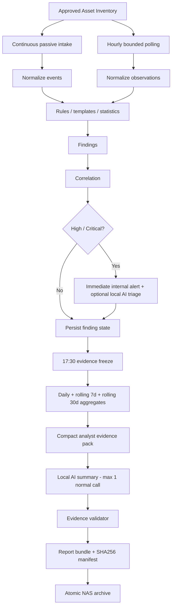

---

# 2. Runtime state model

Each scheduled workflow has a durable run receipt and one terminal state.

```text
SCHEDULED
  -> ACQUIRING_LOCK
  -> COLLECTING
  -> NORMALIZING
  -> ANALYZING_DETERMINISTICALLY
  -> COMMITTING
  -> COMPLETED
```

Allowed failure states:

```text
PARTIAL
BLOCKED_BY_POLICY
DATA_GAP
COLLECTOR_TIMEOUT
STORAGE_FAILED
PENDING_NAS
FAILED
```

Rules:

- no overlapping hourly runs for the same monitoring profile;
- no second run may silently overwrite the receipt of an incomplete first run;
- every stage records bounded metadata and evidence references;
- retries require a classified failure reason;
- default retry count for a network probe is at most one;
- scheduler catch-up may run a missed cycle once after reboot, but must never create a retry storm.

---

# 3. Continuous passive intake

Continuous sources are preferred when devices already emit evidence without active polling.

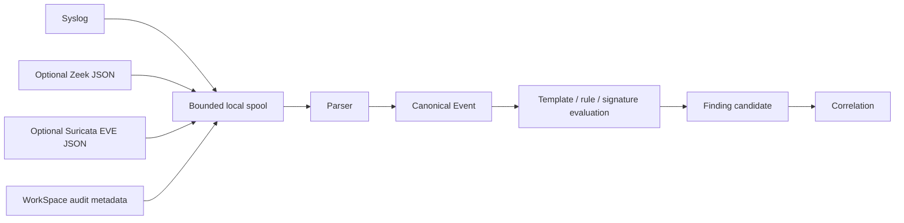

Passive intake requirements:

1. bounded file/spool size;
2. source/device identity from approved configuration, not model inference;
3. parser version and source hash retained;
4. malformed records quarantined rather than dropped silently;
5. raw event payload is not sent to an LLM by default;
6. duplicate events may be deduplicated only when event identity/equivalence is deterministic.

---

# 4. Hourly monitoring workflow

## 4.1 Default cadence

Default time zone: `Asia/Tokyo`.

Recommended scheduler contract:

```text
once per hour
minute = configurable, default 05
persistent catch-up = true
max catch-up runs after downtime = 1
```

Using minute `05` avoids forcing all infrastructure tasks to start at the top of the hour. The cadence remains once per hour.

## 4.2 Full hourly sequence

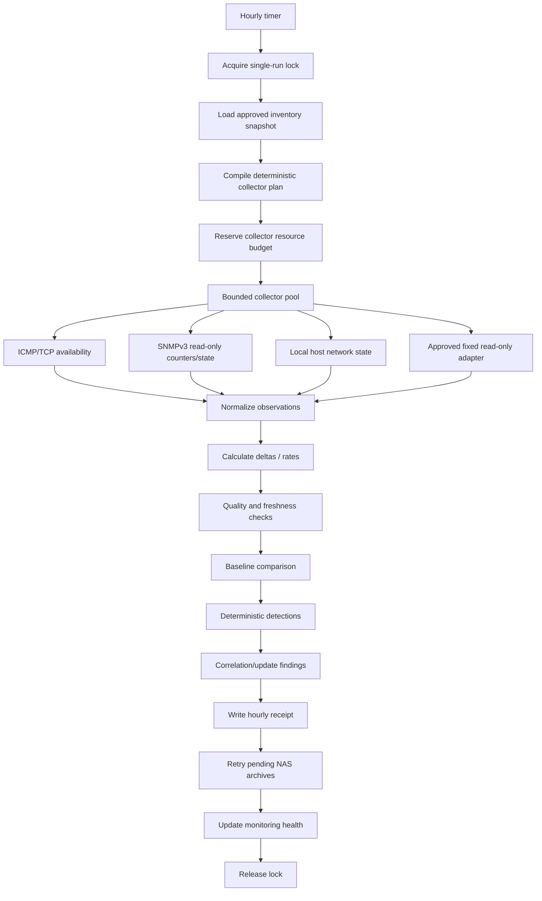

The normal path does not call an AI model.

## 4.3 Collector priority

For each approved device, use the narrowest available read-only method:

```text
SNMPv3 read-only
  > vendor/device read-only API
  > fixed SSH show-command adapter
  > SNMPv2c legacy adapter
```

No model-generated shell command is allowed.

## 4.4 Minimum hourly observations

Where supported:

- host/device reachability;
- round-trip latency;
- packet loss from the bounded probe;
- uptime/boot discontinuity;
- interface administrative/operational state;
- RX/TX octet counters;
- RX/TX packet counters;
- errors/discards;
- interface speed;
- CPU/RAM/temperature only when exposed read-only;
- ARP/FDB/LLDP summary only for approved infrastructure devices;
- syslog/sensor freshness;
- NAS free-space and archive health.

## 4.5 Bandwidth calculation

Bandwidth is computed deterministically from counter deltas:

```text
bytes_delta = current_counter - previous_counter
bps = bytes_delta * 8 / elapsed_seconds
utilization_pct = bps / interface_speed_bps * 100
```

The calculator must detect and label:

- counter reset after reboot;
- counter rollover/wrap;
- missing previous sample;
- invalid elapsed interval;
- interface-speed change.

A discontinuity is a finding/evidence condition, not a reason to manufacture a bandwidth value.

---

# 5. Approved inventory versus observed network

The approved inventory is authoritative configuration. Discovery is evidence only.

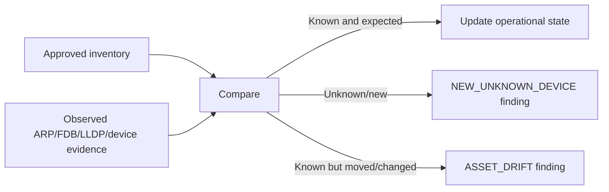

Never automatically promote an observed device into the trusted inventory.

---

# 6. Detection workflow

## 6.1 Deterministic-first detection order

```text
exact rule/signature
  -> threshold/rate rule
  -> baseline comparison
  -> robust statistical anomaly
  -> correlation
  -> optional local AI interpretation
```

AI must not be the first detector for conditions that can be expressed deterministically.

## 6.2 Example network findings

- device unreachable;
- unexpected device appears;
- known MAC changes location;
- interface transitions up/down repeatedly;
- error/discard rate exceeds threshold;
- bandwidth utilization is anomalously high;
- unusual traffic destination/port appears in optional flow metadata;
- IDS signature alert;
- syslog authentication/security event;
- sensor/log source becomes stale;
- NAS archive fails;
- collector coverage drops.

---

# 7. Finding lifecycle

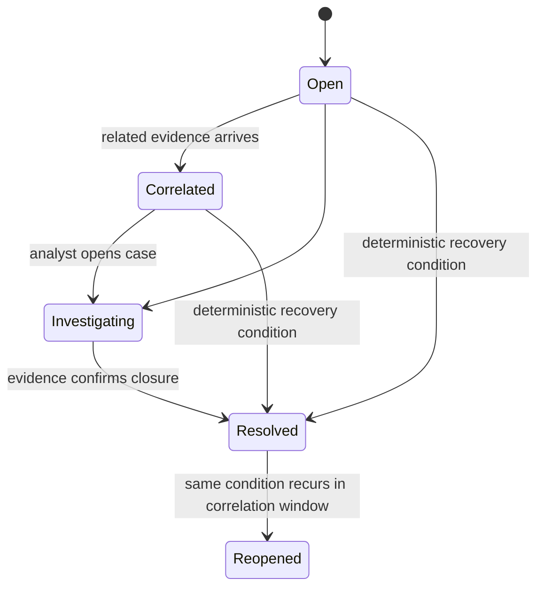

A finding contains evidence references, not only prose.

Minimum fields:

```text
finding_id
first_seen
last_seen
severity
category
asset_refs
source_refs
evidence_refs
rule/template IDs
confidence_basis
status
correlation_key
```

Severity is deterministic policy output. An LLM may explain severity but cannot raise its own authority or trigger remediation.

---

# 8. High/Critical finding workflow

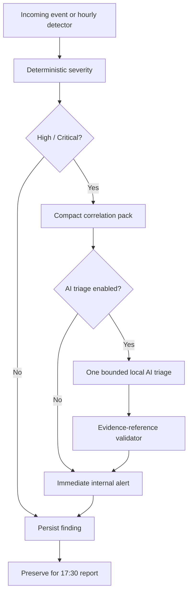

Critical findings do not wait until 17:30.

AI unavailability must not block the deterministic alert.

---

# 9. Sensor/Data-gap workflow

Absence of alerts is not proof of health.

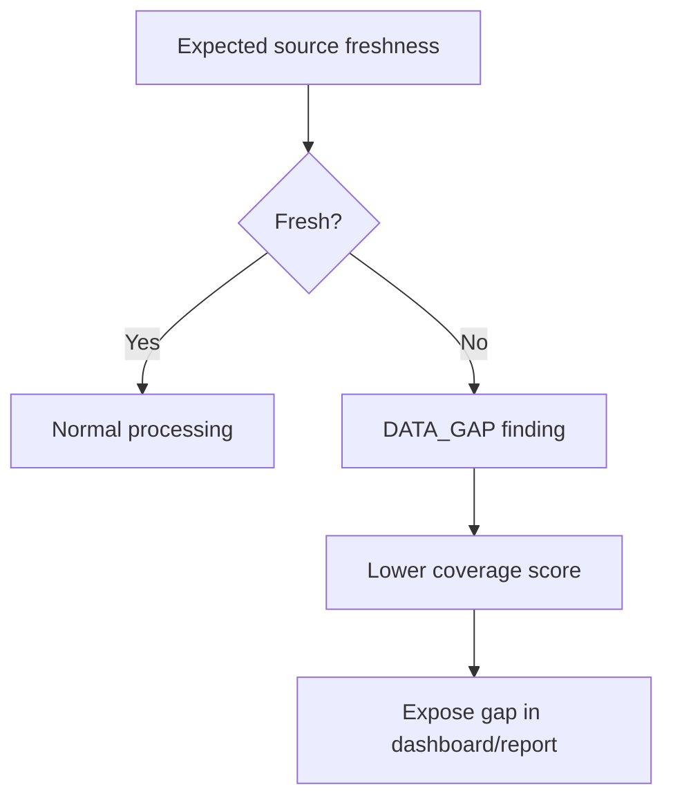

Examples:

- syslog source stops sending;
- SNMP fails for a known device;
- Zeek/Suricata sensor stops updating;
- hourly run is missed;
- evidence partition cannot be committed.

---

# 10. 17:30 daily report workflow

## 10.1 Reporting cutoff

At `17:30 Asia/Tokyo`, freeze a report cutoff. The daily section covers the current local calendar day from `00:00` to the cutoff. It also contains rolling 7-day and rolling 30-day comparisons using data available at the same cutoff.

Late evidence is retained with its true timestamp and appears in the next applicable report/correction workflow; it is not backdated silently.

## 10.2 Full report pipeline

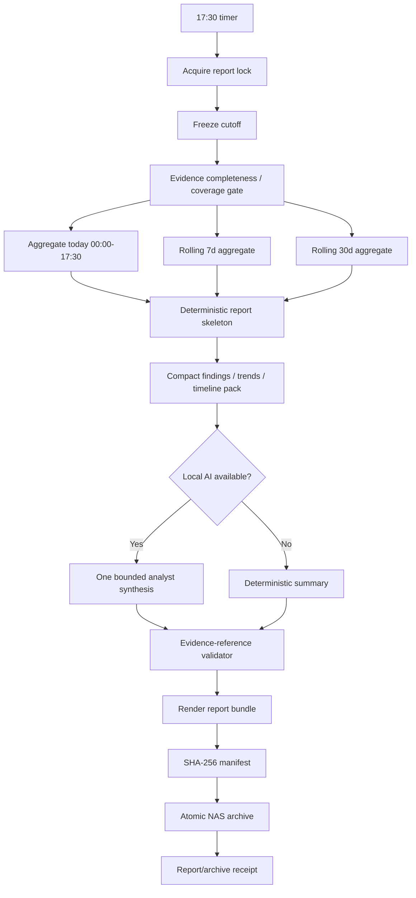

Normal AI budget:

```text
1 local model call
+ at most 1 validator-driven retry
```

The report must distinguish:

```text
FACT
CORRELATION
HYPOTHESIS
RISK
RECOMMENDED ACTION
DATA GAP
```

No prose statement may convert a hypothesis into a verified fact.

---

# 11. Weekly and monthly reporting

The daily 17:30 report always includes rolling 7-day and 30-day views.

Additionally:

## Weekly canonical archive

Default: Sunday at 17:30 Asia/Tokyo.

```text
reuse hourly/daily aggregates
  -> freeze weekly cutoff
  -> canonical week snapshot
  -> weekly report
  -> SHA-256 manifest
  -> atomic NAS archive
```

## Monthly canonical archive

Last local calendar day at 17:30.

```text
reuse hourly/daily aggregates
  -> freeze month cutoff
  -> canonical month snapshot
  -> monthly report
  -> SHA-256 manifest
  -> atomic NAS archive
```

Do not recompute the month from raw logs when validated daily/hourly aggregates are sufficient.

---

# 12. NAS archive workflow

The NAS share must be mounted by the operating system before WorkSpace starts. WorkSpace does not store SMB/NFS passwords in prompts or report configuration.

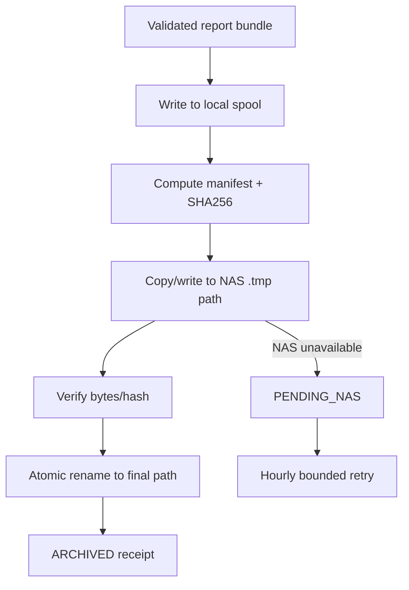

No report may be marked archived until the final destination is verified.

Recommended path template:

```text
<NAS_ROOT>/workspace/security-network/
  daily/YYYY/MM/YYYY-MM-DD/
  weekly/YYYY/Www/
  monthly/YYYY/MM/
  incidents/YYYY/MM/<finding_or_case_id>/
```

---

# 13. Incident packet-capture workflow

Packet capture is outside normal monitoring authority.

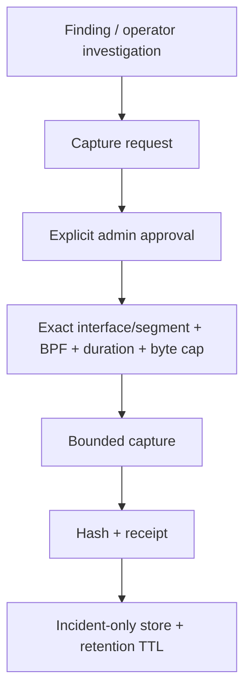

Required capture contract:

```text
purpose
finding/case reference
interface/segment
filter
duration_seconds
max_bytes
retention_ttl
approver_ref
```

There is no autonomous transition from `AI suspects a problem` to packet capture.

---

# 14. Manual analyst workflow

The specialized UI is not only a dashboard. It supports evidence-driven investigation without granting free-form shell authority.

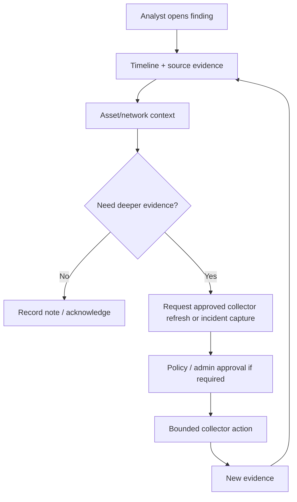

The model may summarize evidence or suggest the next investigation step. It cannot generate arbitrary commands for execution.

---

# 15. Dashboard refresh workflow

The UI must be cheap enough to leave open on an administrator PC.

Default behavior:

```text
page not visible -> no automatic refresh
page visible     -> aggregate/status refresh every 30 seconds
finding detail   -> fetch on demand
raw logs         -> fetch on demand with paging
manual refresh   -> always available
```

No new websocket/message-broker dependency is required for v1.

---

# 16. Failure behavior

## Device unavailable

Record unreachable evidence, update the availability metric/finding, and continue other assets.

## Collector timeout

At most one bounded retry by default, then mark the source incomplete.

## Partial device support

Store supported metrics and mark unsupported fields explicitly; do not synthesize zeros.

## AI unavailable

Generate deterministic report with `AI_ANALYSIS_UNAVAILABLE` status.

## NAS unavailable

Keep the validated bundle in local spool and mark `PENDING_NAS`.

## Sensor stale

Generate `DATA_GAP` rather than interpreting absence of alerts as healthy network.

## Database write failure

Fail the hourly receipt and preserve the bounded recovery record; never claim monitoring completed.

## Reboot during hourly cycle

The interrupted receipt remains incomplete. A persistent timer may run one catch-up cycle after startup; it does not impersonate the missed historical sample.

## Reboot during 17:30 report

Resume from validated aggregates/evidence cutoff where possible; otherwise rebuild the report deterministically from persisted aggregates. Never duplicate a final NAS archive path without idempotency checks.

---

# 17. Workflow invariants

1. **Read-only first** — normal monitoring cannot change switch/router/firewall configuration.
2. **Known targets only** — no autonomous full-LAN scan in the hourly path.
3. **Evidence before AI** — collection, normalization, baselines and rules run first.
4. **Zero normal hourly AI calls** — healthy hourly cycles remain deterministic.
5. **Bounded concurrency** — collectors are parallel only within configured worker/resource limits.
6. **No overlapping schedules** — hourly/daily/weekly/monthly jobs use durable locks/idempotency keys.
7. **Observed != approved** — discovered devices never become trusted inventory automatically.
8. **Data gaps are visible** — missing telemetry lowers confidence/coverage.
9. **Payload minimization** — raw logs/PCAP are not default model context.
10. **NAS is an archive destination, not the primary transactional database**.
11. **No autonomous remediation** — AI recommendations remain advisory.
12. **Every report/finding must remain traceable to evidence references and versioned rules/parsers.**
