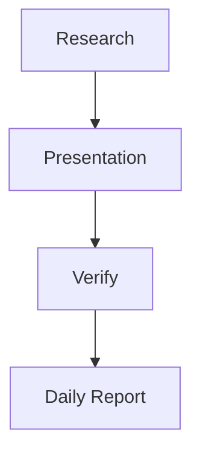

# WorkSpace Dispatch v1

## Purpose

WorkSpace Dispatch turns a user's natural-language goal into a bounded workflow that can be reviewed as:

1. validated workflow JSON;
2. Mermaid flowchart source;
3. a deterministic local SVG diagram;
4. a resource-bounded dispatch plan.

The feature is inspired by the general orchestration pattern visible in modern agent products: plan first, make work observable, keep important actions user-approved, dispatch independent work in parallel only when safe, and verify outputs before completion. The implementation is WorkSpace-owned and does not copy another product's UI, prompts, or runtime.

## Architecture

```text
User description
      |
      v
one local structured model call
      |
      v
untrusted workflow proposal
      |
      v
deterministic WorkflowSpec validator
  - allowed node kinds only
  - 2..12 nodes
  - no cycles / no loops
  - valid dependencies
  - bounded text
  - no authority fields
      |
      +------> Mermaid source
      +------> deterministic local SVG
      +------> topological waves
      +------> dispatch batches <= 2 nodes
      |
      v
execution-adapter check
      |
      +--> preview-only custom DAG
      |
      +--> approved existing adapter
              |
         explicit user approval
              |
              v
       existing WorkflowRunner
       TaskContract / validators
       execution/resource budgets
```

## Enterprise authority model

The workflow compiler proposes structure only. A generated node cannot grant:

- network access;
- filesystem access;
- shell/process execution;
- credentials/secrets;
- deployment authority;
- approval authority;
- additional model authority.

Those controls remain outside model output and continue to be enforced by the existing WorkSpace runtime.

Every dispatch requires an explicit `approved=true` request from the authenticated owner. A workflow draft is owner-scoped and stored locally under the existing artifact root.

## Lean resource policy

Dispatch v1 intentionally avoids a new orchestration framework.

Hard limits:

```text
description           <= 12,000 characters
workflow nodes        <= 12
parallel dispatch     <= 2
compiler model calls  = 1
automatic repair loop = 0
workflow loops        = 0
new dependencies      = 0
new daemon/database   = 0
```

If the one compiler call produces an invalid graph, WorkSpace blocks it instead of spending more inference on self-repair.

Custom DAGs can show conceptual parallelism, but actual execution remains disabled until a reviewed adapter exists. This prevents "diagram implies authority."

## Execution support in v1

The first executable topology is intentionally the already-validated product workflow:



This maps directly to the existing `WorkflowRunner`, which already binds TaskContract, execution budget, model authority and runtime validators.

All other topologies are **preview-only** in v1. This is deliberate: new adapters should be added one capability at a time with tests rather than creating a generic arbitrary-agent executor.

## Diagram safety

Mermaid is returned as inert source code for copy/export. WorkSpace does not load Mermaid.js or any CDN.

The visible diagram is an SVG produced by deterministic Python code. Node IDs are restricted, labels are escaped, and the SVG contains no script, remote image, foreignObject, external URL or event handler.

## Draft lifecycle

```text
DRAFT
  |
  +-- preview-only ------> cannot run
  |
  +-- executable
        |
     user approval
        |
      QUEUED
        |
      RUNNING
       /   \
 COMPLETED FAILED
```

Only one executable workflow is admitted to the Dispatch execution slot at a time in v1. Existing WorkSpace resource/model routing still determines the underlying GPU behavior.

## Future adapters

Candidates for later versions, only after measured need:

- independent local analysis nodes;
- parallel research branches with deterministic join;
- human approval checkpoints;
- document/spreadsheet transformation nodes;
- internal system/tool adapters;
- condition branches;
- scheduled/triggered dispatch.

Loops and open-ended recursive agent creation should remain out of the default enterprise profile unless a bounded, independently verified use case proves their value.
