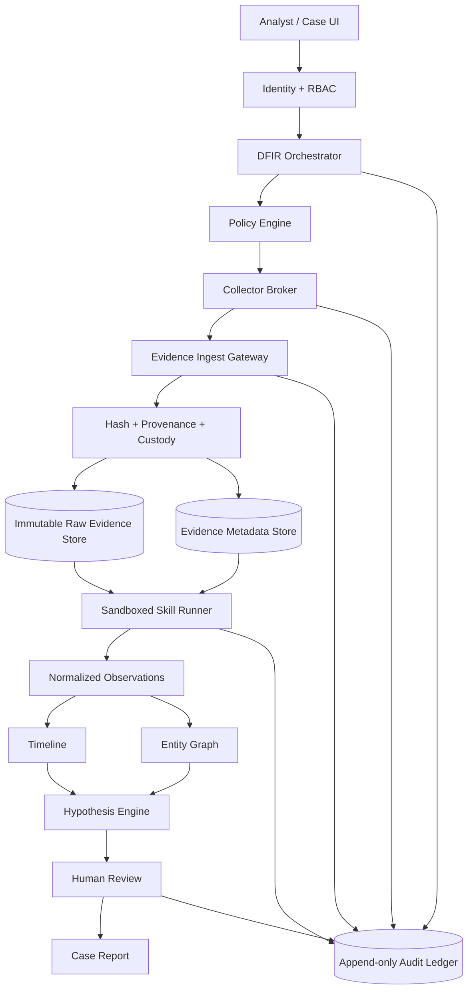

# WorkSpace DFIR Skill Pack v0.1

Status: implementation baseline  
Project: WorkSpace  
Scope: defensive DFIR / authorized investigation only  
Version: `0.1.0`

## 1. Purpose

DFIR Skill Pack v0.1 defines 24 defensive Digital Forensics and Incident Response skills for WorkSpace. The pack is not a collection of prompts and is not an offensive exploitation framework. Every enabled skill must be evidence-bound, read-only by default, reproducible, auditable, case-scoped, and reviewable by a human analyst.

The canonical investigation lifecycle is:

```text
CASE
  -> EVIDENCE
  -> NORMALIZED OBSERVATION
  -> ENTITY / RELATIONSHIP
  -> TIMELINE
  -> HYPOTHESIS
  -> FINDING
  -> HUMAN REVIEW
  -> REPORT
```

Core invariants:

1. Evidence is the source of truth; AI is not.
2. Observation and conclusion are separate record types.
3. No finding may cite a nonexistent evidence reference.
4. Material contradictory evidence must be surfaced, not hidden.
5. Missing telemetry is not equivalent to negative evidence.
6. Raw evidence is immutable after ingest.
7. Every derived artifact carries provenance and `derived_from[]` references.
8. Default skill execution has no arbitrary target command execution, no remediation authority, and no uncontrolled Internet egress.
9. Existing WorkSpace primitives must be reused when semantically adequate; this pack must not create duplicate parsers, correlation engines, or policy layers merely to satisfy a skill ID.

## 2. Priority model

- `P0`: foundation required before production eligibility.
- `P1`: core investigation capability.
- `P2`: enrichment / advanced analytics.

## 3. Skill registry

| ID | Skill ID | Priority | Primary output |
|---|---|---:|---|
| DFIR-01 | `dfir.evidence_preservation` | P0 | `EvidenceObject` |
| DFIR-02 | `dfir.incident_scope_builder` | P0 | `ScopeSnapshot` |
| DFIR-03 | `dfir.network_session_reconstruction` | P1 | `NetworkSession` |
| DFIR-04 | `dfir.pcap_forensic_analysis` | P1 | `PacketObservation` |
| DFIR-05 | `dfir.dns_trace_analysis` | P1 | `DnsObservation` |
| DFIR-06 | `dfir.tls_connection_analysis` | P2 | `TlsObservation` |
| DFIR-07 | `dfir.http_transaction_trace` | P2 | `HttpObservation` |
| DFIR-08 | `dfir.network_flow_correlation` | P1 | `NetworkFlow` |
| DFIR-09 | `dfir.authentication_forensics` | P1 | `AuthEvent` |
| DFIR-10 | `dfir.windows_event_forensics` | P1 | `WindowsEvent` |
| DFIR-11 | `dfir.process_tree_reconstruction` | P1 | `ProcessEvent` / graph edge |
| DFIR-12 | `dfir.persistence_hunt` | P1 | `PersistenceFindingCandidate` |
| DFIR-13 | `dfir.filesystem_artifact_analysis` | P1 | `FilesystemArtifact` |
| DFIR-14 | `dfir.memory_forensics` | P1 | `MemoryObservation` |
| DFIR-15 | `dfir.malware_indicator_analysis` | P2 | `IndicatorMatch` |
| DFIR-16 | `dfir.lateral_movement_trace` | P1 | `MovementEdge` |
| DFIR-17 | `dfir.credential_abuse_trace` | P2 | `IdentityFindingCandidate` |
| DFIR-18 | `dfir.exfiltration_analysis` | P2 | `TransferFindingCandidate` |
| DFIR-19 | `dfir.anti_forensics_detection` | P1 | `AntiForensicsFindingCandidate` |
| DFIR-20 | `dfir.super_timeline_builder` | P0 | `TimelineEvent[]` |
| DFIR-21 | `dfir.ioc_pivot_graph` | P1 | `EntityRelation[]` |
| DFIR-22 | `dfir.attack_path_reconstruction` | P1 | `AttackPathCandidate[]` |
| DFIR-23 | `dfir.hypothesis_testing` | P0 | `Hypothesis` |
| DFIR-24 | `dfir.forensic_case_reporter` | P0 | `CaseReport` |

## 4. Canonical skill contract

Each skill is represented by a versioned manifest and a runtime contract.

```yaml
skill:
  id: dfir.network_session_reconstruction
  version: 0.1.0
  priority: P1

purpose:
  reconstruct authorized investigation network activity from preserved evidence

inputs:
  - evidence_ref
  - case_id
  - time_window
  - typed_parameters

outputs:
  - observations
  - entities
  - relationships
  - evidence_refs
  - limitations

permissions:
  read_evidence: true
  read_index: true
  read_network_evidence: true
  live_collection: false
  arbitrary_shell: false
  target_exec: false
  network_scan: false
  exploitation: false
  remediation: false
  filesystem_write_target: false
  external_egress: false

controls:
  provenance_required: true
  supporting_evidence_required: true
  contradictory_evidence_required: true
  case_scope_required: true
  human_review_required_for_finding: true
```

## 5. Permission boundary

Canonical permission profiles:

- `RO-EVIDENCE`: read already-ingested evidence only.
- `RO-NET`: read network evidence through an approved Evidence Gateway.
- `RO-ENDPOINT`: request only allow-listed semantic collection primitives through a Collector Broker.
- `RO-INDEX`: query normalized evidence/indexes.
- `NO-EGRESS`: skill runner cannot independently access the Internet.
- `NO-EXEC-TARGET`: no arbitrary shell, PowerShell, command execution, or unrestricted VQL/SQL on investigated targets.
- `NO-REMEDIATE`: no kill, delete, quarantine, firewall write, account disable, registry modification, service modification, or configuration change.

Live collection must record a `collection_footprint`; it must never be described as guaranteed zero-impact.

Collector APIs must be semantic and allow-listed. Forbidden design:

```text
execute(command)
run_powershell(script)
run_arbitrary_sql(sql)
run_arbitrary_vql(vql)
```

Preferred design:

```text
read.evtx(channel, start, end)
read.file(approved_path_id, case_authorization)
read.osquery(query_id, typed_parameters)
read.velociraptor(artifact_id, typed_parameters)
read.arkime.sessions(filter_id, time_window)
read.pcap(evidence_id, packet_range)
```

## 6. Enterprise Evidence Model v1

Required top-level record types:

```text
evidence_object
observation
entity
relationship
finding
hypothesis
skill_run
audit_event
report
```

Minimum evidence fields:

```yaml
schema_version: 1.0.0
record_id: EV-...
case_id: CASE-...
record_type: evidence_object
created_at: RFC3339
classification: restricted
integrity:
  status: verified|failed|not_verifiable
  content_digest:
    algorithm: sha256
    value: <64 lowercase hex chars>
  acquisition_digest: optional
  transport_digest: optional
  byte_size: integer
provenance:
  source_type: endpoint|sensor|pcap|event_log|memory_image|filesystem_image|api|derived_dataset|synthetic_fixture
  source_id: string
  source_host: optional
  original_path: optional
  collector:
    name: string
    version: string
    build_digest: optional
  collected_at: RFC3339
  acquisition_method: string
  collection_footprint: optional
  custody: []
derived_from: []
entities: []
data: {}
```

Chain-of-custody is append-only. Raw evidence must never be silently replaced by normalized or derived content.

### 6.1 Time model

Every forensic timestamp should preserve:

```text
timestamp_utc
timestamp_original
timezone_original
clock_source
clock_uncertainty_ms
semantic
```

Timeline sorting must not erase uncertainty or clock disagreement between hosts/sensors.

### 6.2 Entity model

Canonical entities include at least:

```text
host
ip
domain
url
user
account
process
file
certificate
session
service
registry_key
```

An entity node is not evidence. A forensic relationship is valid only when backed by one or more provenance-aware observations/evidence references.

## 7. Confidence and hypothesis model v1

Confidence is an evidence-weighted engineering score, not a statistical probability.

```text
score = min(cap,
            0.30 * directness
          + 0.25 * integrity
          + 0.20 * temporal_entity_correlation
          + 0.15 * source_independence
          + 0.10 * baseline_support
          - contradiction_penalty)
```

Suggested bands:

```text
insufficient < 0.40
low          0.40-0.59
medium       0.60-0.79
high         0.80-0.94
very_high    >= 0.95
```

Mandatory safeguards:

- one logical source only: cap at `0.69`;
- unverifiable integrity: cap at `0.59`;
- unresolved material contradiction: cap at `0.79`;
- parser quality is separate from incident confidence;
- no single IOC may automatically produce a compromise verdict.

Hypothesis states:

```text
open
supported
contradicted
inconclusive
confirmed-by-human
```

Required reasoning sequence:

```text
observation
  -> correlation
  -> hypothesis
  -> supporting evidence
  -> contradicting evidence
  -> limitations / missing evidence
  -> confidence
  -> human review
```

## 8. Skill specifications

### DFIR-01 `dfir.evidence_preservation`

Purpose: ingest and preserve evidence immutably. Inputs may include PCAP, EVTX, memory image, filesystem image, JSONL, or collector object. Hash with SHA-256 at acquisition and after transfer where possible. Digest mismatch fails closed and is never silently repaired.

### DFIR-02 `dfir.incident_scope_builder`

Purpose: identify affected assets, users, IPs, sessions, time windows, and available telemetry. Every inclusion/exclusion must cite evidence. DHCP reuse, NAT, stale inventory, and shared infrastructure must be considered as contradictory context.

### DFIR-03 `dfir.network_session_reconstruction`

Purpose: reconstruct ordered network sessions from PCAP and normalized sensor data. Preserve source-specific identifiers such as Zeek `uid`, Suricata `flow_id`, packet references, and external session IDs.

### DFIR-04 `dfir.pcap_forensic_analysis`

Purpose: parse PCAP/PCAPNG into packet and conversation observations. Preserve packet number/offset/time, capture interface, snaplen, truncation state, parser version, and raw evidence reference. This skill produces facts, not a compromise verdict.

### DFIR-05 `dfir.dns_trace_analysis`

Purpose: correlate DNS query -> response -> client -> subsequent connection. Account for resolver caching, shared resolvers, proxying, TTL, reused IPs, and NXDOMAIN behavior.

### DFIR-06 `dfir.tls_connection_analysis`

Purpose: analyze TLS metadata, SNI, certificate hashes, negotiated parameters, fingerprints, and session relationships where available. Shared CDN certificates, TLS interception, missing SNI, and session resumption are mandatory counterexamples.

### DFIR-07 `dfir.http_transaction_trace`

Purpose: correlate request/response transactions, host, method, URI metadata, status, and derived file references where policy permits. Never replay requests. Sensitive headers must follow redaction policy while retaining provenance.

### DFIR-08 `dfir.network_flow_correlation`

Purpose: normalize and merge Zeek/Suricata/Arkime/firewall flow semantics without losing source-specific IDs. NAT, asymmetric visibility, packet loss, and tuple reuse must remain explicit ambiguity sources.

### DFIR-09 `dfir.authentication_forensics`

Purpose: analyze authentication success/failure/logoff/session evidence across Windows, VPN, RDP, SSH, SSO, or other approved sources. Context must distinguish service accounts, jump hosts, automation, VPN reassignment, and legitimate administrator behavior.

### DFIR-10 `dfir.windows_event_forensics`

Purpose: normalize Windows EVTX/Sysmon/Security/System/PowerShell events. Preserve channel/provider/event identity and parser errors/gaps. Required artifact families include authentication, process, service, RDP, PowerShell, account, audit-policy, and log-clear evidence when available.

### DFIR-11 `dfir.process_tree_reconstruction`

Purpose: reconstruct `user -> logon session -> process -> child process -> network/file` relationships. PID reuse, orphan children, telemetry restarts, and clock uncertainty must be handled explicitly.

### DFIR-12 `dfir.persistence_hunt`

Purpose: identify candidate persistence through service/task/startup/registry/configuration artifacts without modifying them. Approved software deployment, management agents, and long-established baseline mechanisms are mandatory benign counterexamples.

### DFIR-13 `dfir.filesystem_artifact_analysis`

Purpose: analyze filesystem and endpoint artifacts such as MFT-like metadata, Prefetch, Amcache, Shimcache, SRUM, registry, and other supported sources. Read-only mounts only. Timestamp semantic conflicts must be preserved.

### DFIR-14 `dfir.memory_forensics`

Purpose: analyze acquired memory images for process, module, socket, handle, command/runtime, injection-like, kernel, and YARA-like observations as supported by approved tooling. No live introspection from the skill runner. Tool/symbol/profile versions and offsets are provenance.

### DFIR-15 `dfir.malware_indicator_analysis`

Purpose: match hashes, metadata, and approved static rule corpora such as YARA-style rules without executing samples. Rule ID/version/digest/license must be recorded. A match is an observation, not automatically a malware verdict.

### DFIR-16 `dfir.lateral_movement_trace`

Purpose: reconstruct candidate host A -> identity -> host B movement from authentication, network, process, service/share, and endpoint evidence. Legitimate orchestration, patching, and jump-server administration are required counterexamples.

### DFIR-17 `dfir.credential_abuse_trace`

Purpose: identify suspicious credential-use patterns without ingesting passwords/tokens. Evidence may include unusual source/device/time and downstream behavior; VPN, travel, service accounts, and approved administrative workflows must be evaluated as contradictory context.

### DFIR-18 `dfir.exfiltration_analysis`

Purpose: identify candidate outbound data transfer using volume, destination, protocol, process/session linkage, business context, and historical baseline. Backup, replication, CDN upload, and legitimate business transfer are mandatory negative controls.

### DFIR-19 `dfir.anti_forensics_detection`

Purpose: detect log clearing, telemetry gaps, audit-state changes, deletion, timestomp-like inconsistency, or evidence-destruction candidates. `No logs found` never means `no attack`. Rotation, maintenance, sensor outage, and clock/timezone error must be considered.

### DFIR-20 `dfir.super_timeline_builder`

Purpose: normalize all observations into a common temporal model while retaining original timestamps and uncertainty. Conflicting clocks must be represented, not silently resolved. Output must be deterministic under input permutation.

### DFIR-21 `dfir.ioc_pivot_graph`

Purpose: build provenance-aware pivots such as `IP <-> domain <-> host <-> user <-> process <-> file <-> certificate <-> session`. External enrichment is separate from forensic truth and must pass a distinct policy boundary.

### DFIR-22 `dfir.attack_path_reconstruction`

Purpose: produce one or more evidence-backed candidate paths with ordering, missing links, alternatives, and limitations. No graph edge may be invented without evidence or an explicit inference marker.

### DFIR-23 `dfir.hypothesis_testing`

Purpose: formalize an investigation question and retrieve supporting, contradicting, and missing evidence. The LLM may not invent evidence IDs. `confirmed-by-human` is impossible without an explicit review action.

### DFIR-24 `dfir.forensic_case_reporter`

Purpose: create a case report containing methodology, evidence manifest, limitations, timeline, findings, contradictions, unresolved questions, skill/rule versions, and evidence citations. Final report requires analyst and security/case review according to policy.

## 9. Harness architecture



Sandbox requirements:

- non-root worker;
- read-only root filesystem;
- read-only evidence mounts;
- bounded scratch area;
- no privilege escalation;
- dropped capabilities;
- syscall filtering where available;
- no network egress by default;
- CPU/RAM/time/process/file-count limits;
- archive traversal, symlink, decompression, and path escape defenses;
- deterministic failure on quota or policy violation.

Audit events must record at least actor/service identity, case, capability request, policy decision, evidence IDs read, skill version, runner/image digest, adapter version, rule corpus digest, timestamps, outputs, review actions, and failure state. Never log secrets unless the secret itself is governed evidence.

## 10. Synthetic fixture registry

Fixtures must use reserved/example identifiers, inert payloads, no real credentials, no real victim data, and no live malware.

| Fixture | Purpose |
|---|---|
| C1 | valid evidence + complete provenance |
| C2 | tampered/truncated evidence variants |
| N1 | DNS -> TLS -> HTTP-like benign/suspicious-shaped PCAP |
| N2 | multi-host admin + candidate lateral path |
| N3 | normal backup + abnormal synthetic outbound transfer |
| Z1 | Zeek JSONL bundle with known UIDs |
| S1 | Suricata EVE bundle with correlated `flow_id` |
| W1 | synthetic authentication event set |
| W2 | synthetic process/persistence event set |
| W3 | anti-forensics / normal rollover counterexample set |
| F1 | filesystem artifact lab bundle |
| M1 | clean memory fixture |
| M2 | synthetic investigation memory fixture |
| O1 | osquery-like snapshots |
| O2 | osquery-like event stream |
| I1 | inert indicator corpus |
| T1 | cross-source incident scenario with alternate hypotheses |
| R1 | report fixture with deliberate broken evidence reference |

Every fixture must include a manifest with version, hashes, safety flags, ground truth, and expected outputs.

## 11. Required test layers

Every skill must pass:

1. schema conformance;
2. golden-output test;
3. negative/counterexample test;
4. tampered-input test where applicable;
5. determinism test;
6. resource/sandbox test.

Correlation skills also require permutation tests: changing input order must not change the canonical graph/timeline result.

Reasoning skills require adversarial evidence tests: a suspicious IOC with strong benign context must not produce high confidence.

### 11.1 Minimum fixture mapping

```text
DFIR-01 -> C1,C2
DFIR-02 -> T1,O1,Z1
DFIR-03 -> N1,Z1,S1
DFIR-04 -> N1,N2,N3
DFIR-05 -> N1,Z1
DFIR-06 -> N1,Z1
DFIR-07 -> N1,Z1,S1
DFIR-08 -> Z1,S1,N1
DFIR-09 -> W1,O1,T1
DFIR-10 -> W1,W2,W3
DFIR-11 -> W2,O2,M2
DFIR-12 -> W2,F1,O1
DFIR-13 -> F1
DFIR-14 -> M1,M2
DFIR-15 -> I1
DFIR-16 -> N2,W1,W2,T1
DFIR-17 -> W1,O1,T1
DFIR-18 -> N3,Z1,S1
DFIR-19 -> W3,F1,T1
DFIR-20 -> T1 + all families
DFIR-21 -> T1,I1,Z1,W2
DFIR-22 -> T1
DFIR-23 -> T1 + positive/negative/ambiguous hypotheses
DFIR-24 -> R1,T1
```

## 12. Existing-capability reuse and duplicate gate

Before implementing any DFIR skill, WorkSpace must inventory the current repository and classify semantically equivalent capabilities.

Required classification:

| Status | Meaning | Required action |
|---|---|---|
| `COMPLETE` | required contract + tests already satisfied | reuse; do not reimplement |
| `ADEQUATE` | functionality sufficient; small metadata/docs gap | extend metadata only |
| `PARTIAL` | useful implementation exists but contract/tests incomplete | harden/extend existing module |
| `FOUNDATION` | reusable primitive exists | depend on it; do not duplicate |
| `OVERLAP` | multiple modules implement same semantics | consolidation review |
| `GAP` | no useful implementation exists | implement new capability |
| `UNKNOWN` | insufficient evidence | do not implement yet |

A module should be reused rather than rewritten when all mandatory controls pass:

- same or compatible purpose;
- lossless input/output adapter possible;
- provenance/evidence references preserved;
- permission boundary no broader than required;
- negative fixtures pass;
- deterministic behavior where required;
- owner/maintenance path exists;
- license/integration mode is acceptable.

No new DFIR implementation may be merged merely because a matching skill ID does not already exist. A skill may be an orchestration profile over existing WorkSpace primitives.

## 13. External engine boundary

External tools are adapters/engines, never the canonical WorkSpace data model.

Candidate boundaries:

- Zeek: semantic network logs / connection-DNS-HTTP-TLS metadata.
- Arkime: searchable session metadata and packet evidence retrieval.
- Suricata: EVE JSON ingest preserving `flow_id` and transaction identity.
- osquery: approved typed query catalog; no arbitrary SQL from the reasoning layer.
- Velociraptor: approved reviewed artifact IDs via a broker; no arbitrary VQL from the reasoning layer.
- Plaso: offline timeline parser -> canonical timeline adapter.
- Timesketch: optional analyst timeline UI/import target, not raw forensic parser.
- Volatility 3: memory analysis behind a separately reviewed process/license boundary.
- Sigma: rule registry with upstream source/version/license/provenance.
- YARA: offline static matching with rule digest/version and file hash.

Third-party integration must record license, integration mode, redistribution state, modification state, and legal-review state. Copyleft or custom-license components must not be embedded into proprietary distribution without explicit review.

## 14. Definition of Done

### P0 platform gate

- repository capability inventory covers all relevant security/analyst/network modules;
- canonical evidence schema is versioned and validated;
- acquisition/transport hash mismatch fails closed;
- raw/derived provenance and append-only custody are implemented;
- skill runner cannot write target systems or access uncontrolled Internet egress;
- case-scoped RBAC/authorization is enforced;
- every evidence/skill/review access creates audit evidence;
- C1/C2/T1 plus required network/Windows/memory/osquery fixture families have manifests and hashes;
- DFIR-01/02/20/23/24 pass schema, negative, determinism, and permission tests;
- no finding can self-transition to `confirmed-by-human`;
- every material report claim resolves to evidence references;
- duplicate/reuse gate is enforced;
- external adapter license/integration state is recorded.

### P1 end-to-end gate

At least one deterministic case replay must pass:

```text
immutable PCAP / EVTX / memory / endpoint evidence
  -> verified provenance
  -> normalized observations
  -> entity resolution
  -> super timeline
  -> network + process + identity correlation
  -> candidate hypotheses
  -> support AND contradiction retrieval
  -> human review
  -> evidence-cited case report
```

Production eligibility is not `24/24 skills coded`. Production eligibility means every enabled skill has a versioned contract, least-privilege permission manifest, positive and negative fixtures, deterministic conformance tests, complete evidence provenance, explicit contradiction behavior, auditability, and a human-review boundary.

## 15. Repository audit procedure before implementation

The next development phase MUST audit the current WorkSpace repository before creating new DFIR code. At minimum inspect:

```text
security modules
analyst modules
network monitoring / telemetry modules
correlation and graph modules
evidence / provenance / audit modules
inventory and identity boundaries
chat / intelligence integration
schemas and manifests
test fixtures and evaluation assets
CI/security gates
third-party adapters and licenses
```

Build a capability registry containing:

```text
path
module_id
aliases
purpose
inputs
outputs
schema_ids
permissions
collectors
parsers
fixtures
tests
rule_sources
dependencies
license
last_modified
status
```

Only after this audit may the implementation backlog be created. The backlog must be derived from `COMPLETE/ADEQUATE/PARTIAL/FOUNDATION/OVERLAP/GAP/UNKNOWN` evidence and must explicitly mark capabilities that are forbidden to rewrite because the existing implementation is already adequate.

## 16. Governance

Development order for each new DFIR checkpoint:

```text
GOAL
-> REPOSITORY DISCOVERY
-> REUSE / DUPLICATE DECISION
-> SPEC
-> HARNESS
-> PASS/FAIL CONTRACT
-> FIXTURES / ADVERSARIAL CASES
-> CODE
-> TEST
-> SECURITY REVIEW
-> DFIR ANALYST REVIEW
-> EXACT-HEAD CI
-> MERGE MAIN
-> VERIFY MAIN
-> NEXT CHECKPOINT
```

Do not lower existing WorkSpace security gates for DFIR integration. Do not add offensive scanning/exploitation/remediation authority to analysis skills. Do not duplicate an existing capability that already meets the required contract.